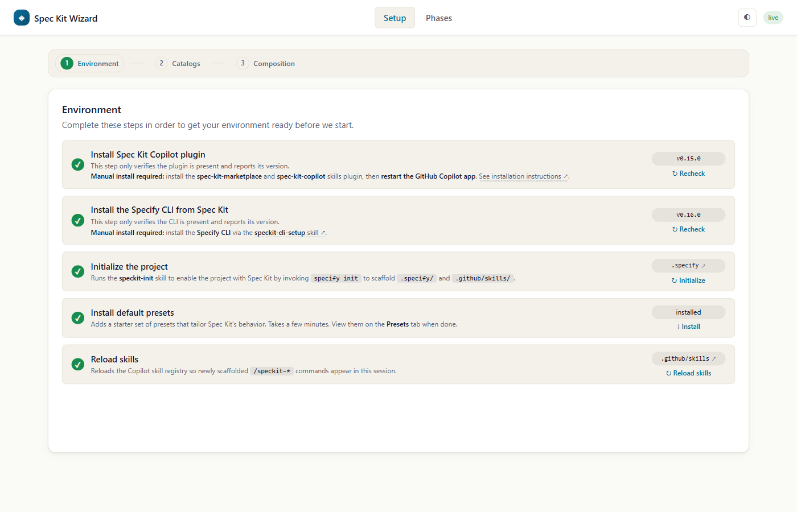
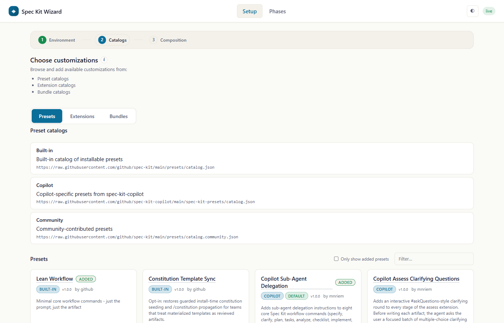

# speckit-wizard

A **visual, guided wizard** that brings Spec-Driven Development into an
interactive canvas — a showcase of both the [Spec Kit `specify`
CLI](https://github.com/github/spec-kit) and the
[`spec-kit-copilot`](https://github.com/github/spec-kit-copilot) plugin.
Ships as a GitHub Copilot **canvas extension** that sits on top of the
plugin's `speckit-*` skills (which in turn shell out to the `specify`
CLI) and gives you three complementary ways to work with them:

1. **Discover.** Browse the full catalog of presets, extensions,
   and bundles that customize the SDD lifecycle — with
   descriptions, source, and one-click activation, all in one place.
2. **Visualize the composition.** See how the presets and extensions
   you've layered on top of core combine — which layer contributes which
   artifact, where the hooks come from, and the resulting pipeline your
   project will actually run:

   ```
   setup → constitution → specify → clarify → plan → tasks → analyze → checklist → implement
   ```
3. **Execute the lifecycle.** Drive every phase from the **Phases** tab —
   click a phase in the pipeline, fill its form, watch the agent produce
   the artifact via the matching `speckit-*` skill.

Everything under the hood routes through the `spec-kit-copilot` plugin's
skills, so the same guardrails and behaviors apply whether you drive
Spec Kit from the wizard, from chat, or from the `specify` CLI.

### The four main pages

**Setup → Environment** — verifies prerequisites (plugin, CLI, project init,
default presets, skills reload) and lights up each step as it completes.



**Setup → Catalogs** — browse Built-in, Copilot, and Community catalogs of
presets, extensions, and bundles, and add the ones you want to your project.



**Setup → Composition** — the layered view of what your project actually runs:
per-artifact stacks (commands, templates, scripts, hooks) resolved across
Core, presets, and extensions, plus a Layers sidebar in precedence order.


**Phases** — the executable pipeline. Click any phase to see its active
artifacts, provide input, and run the matching `speckit-*` skill.


### Browser tests

Install the Specify CLI separately (`uv tool install specify-cli` or
`pipx install specify-cli`) and ensure `specify` is on `PATH`:
`specify --version` must succeed in the shell running the tests. Node
dependencies do not install the CLI. From this extension directory, run
`npm ci`; also run `npm ci` in the sibling
`speckit-canvas-designer` extension directory. Then run
`npx playwright install chromium` and `npm run test:e2e` here.
The browser tests live in the repository's
`tests/e2e/` directory and start a local Wizard server with fixed
catalog data. The contract journey in `contracts.spec.mjs` injects raw
`specify … list --json` responses through the real inventory reader, captures
the launch prompt, and opens the resulting handoff in a Designer shell;
only this mocked journey needs no live agent or Specify installation.
`specify-fixtures.spec.mjs` runs the CLI to initialize projects, install
packages, and read inventory, so the full browser suite requires Specify.
`wizard-journeys.spec.mjs` uses isolated temporary checkouts and controlled
test-only preset/extension packages for catalog, refresh, phase, and output
journeys; it does not depend on live catalog inventory. The local test server
defaults to port 4177; set `SPECKIT_E2E_PORT` to use another port (and pass
Playwright `--output` when running multiple suites concurrently).
The [user-flow test plan](../../../../docs/testing/wizard-designer-test-plan.md)
and [implementation audit](../../../../docs/testing/wizard-designer-implementation-plan.md)
record coverage and existing-test decisions.
`.github/workflows/wizard-e2e.yml` runs them on PRs targeting `main` when
the Wizard/Designer plugin, Canvas Design extension, presets, or E2E tests change.
The check is advisory until branch protection
is configured separately; its always-present gate can later be made required
without blocking unrelated PRs on a skipped workflow.

### Data contracts

`contracts/agent-pipeline.mjs`, `agent-artifacts.mjs`, and `agent-phase.mjs`
define the agent's inferred pipeline, artifact evidence, and phase action
inputs. `contracts/wizard-state.mjs` normalizes persisted state, including
older records; `contracts/specify-inventory.mjs` normalizes raw CLI responses.
Action handlers, state persistence, prompt dispatch, and subprocess execution
remain at their existing boundaries. Designer handoff validation lives in the
sibling provider's `contracts/wizard-handoff.mjs`; the Wizard builds that same
versioned shape without importing the separately packaged provider at runtime.

## Quickstart

> This is a **canvas extension** — it opens in the **GitHub Copilot app**
> side panel, not the terminal CLI. There is no slash command or menu
> entry.

1. Register the marketplace and install it (see [Install](#install)):

```bash
  copilot plugin marketplace add OWNER/spec-kit-copilot
   copilot plugin install spec-kit-copilot-wizard@spec-kit-staging
```
2. Ask Copilot in chat: **"Open the Spec Kit Wizard"**.

The agent opens the wizard in a side panel. See
[Opening the dashboard](#opening-the-dashboard) for details.

## What it does

- **Guided setup** — the **Setup** tab walks you step-by-step through
  getting your environment ready to run Spec Kit. The wizard checks
  each step and tells you what to do next.
- **Catalogs** — browse built-in, Copilot, and community catalogs for
  presets, extensions, and bundles. Install them to customize your SDD
  lifecycle.
- **Composition** — see which presets and extensions are layered on top
  of core, and their composed artifacts.
- **Phases pipeline** — the **Phases** tab shows a live pipeline of every
  phase in your lifecycle. Each phase corresponds to a command you
  execute — customize the commands in the pipeline, provide input to
  execute them, and view each artifact produced.

Phase cards list the Markdown files and folders their commands produce,
including multiple outputs when the installed skill identifies them. Outputs
with the same named root and filename remain distinct when their root paths
differ. The default output opens in the artifact viewer when the file exists;
folders and not-yet-created files offer a link to an existing parent folder
instead.
Inferred paths use one location form at a time: a repository-relative path,
`relativeTo: "feature"` for the active feature directory (including
`FEATURE_DIR`), or `root: {name, path?}` for a different named output
directory. Combining `root` and `relativeTo` is invalid.
Inference submissions fetch `/api/state` from the same Wizard instance and
copy each current request fingerprint into the POST programmatically. They
check the requested command IDs before posting; a stale request still fails
the server's fingerprint validation rather than saving outdated evidence.
Opening an expected output in the viewer before it exists shows an
"Output not ready or not found" message rather than a raw 404.
The **Composition** button reads **Refresh** when idle, whether or not the latest
data is up to date; progress and retry messages appear beside it. It rechecks
installed skills and refreshes the phase output evidence; catalog install/remove actions refresh it as
part of their normal update. On the Phases tab, a prominent status row above
the phase cards stays visible while pipeline or output inference is pending,
briefly confirms completion, and remains visible with retry guidance if a
refresh cannot finish. Merely opening the Phases tab does not start an
inference turn.
An unreadable output cache marks an active inference incomplete immediately,
rather than leaving the refresh pending until its fallback timeout.
Effective skill and script sources, as well as the artifact evidence cache, are
read through a single file handle with path/identity checks and a 512 KiB cap,
so changing a workspace file during a refresh cannot bypass the read limit.
The skill's output declaration is parsed from the same bytes used to fingerprint
it, so a concurrent skill edit cannot mix two versions in one snapshot.
Cache updates use an exclusive temporary file in a revalidated directory and
atomically replace the destination rather than writing through a cache symlink.
The extension-artifact scanner uses these same cache read and write paths when
hydrating outputs and pruning entries for removed extensions.

## Opening the dashboard

This is a **canvas extension**, so it renders in the **GitHub Copilot app**
side panel — not in the plain terminal CLI. Installing the plugin
only *registers* the canvas; nothing opens automatically.

To open it, ask Copilot in chat, e.g. **"Open the Spec Kit Wizard"** (or
"open the wizard"). The agent matches your request to this canvas
(`id: speckit-wizard`, displayName **"Spec Kit Wizard"**) and opens it
in a side panel. There is no slash command or menu entry — discovery is
the agent matching the canvas name/description.

Once it is open you can drive it two ways:

- **Click through the wizard UI** in the canvas.
- **Ask the agent in chat** to run a step or open a view for you.

## How it drives the pipeline

Buttons in the canvas POST to a loopback HTTP endpoint, which calls
`session.send({ prompt: "/skill:speckit-<command> …" })`. The skill runs
in your normal chat session — watch the transcript for the agent's work
and any prompts (e.g. slug confirmation, clarifying questions, etc).
Treat the wizard as a launcher: avoid rerunning the same phase until the
active chat turn for that run has finished.

Commands are restricted to the `speckit-*` skills of the customized
lifecycle, and feature slugs are normalized to `[a-z0-9-]`, so the
canvas can only trigger phases that belong to your composed pipeline.

## Agent-callable actions

You can drive the wizard with natural-language prompts at any point —
the agent maps what you ask into canvas actions and the UI updates
accordingly. The extension registers **13 actions** across four groups:

**Verbs (agent-initiated work):**
- `runPhase` — dispatch a phase's `/speckit-<phase>` slash command with the
  wizard tracking preamble (same code path as the Run phase button).
- `addPreset` — install a preset by id (same code path as the Install button).
- `addExtension` — install a Spec Kit extension by id (same code path as
  the Install button).
- `addPipelinePhases` — add ordered command phases to the Phases pipeline
  without removing or reordering existing steps. Given a README link, the
  agent reads its workflow and supplies installed command IDs with optional
  `after` anchors; automatic hook commands are not addable.
- `reloadSessionSkills` — reload Copilot's in-memory skill registry for
  the session (equivalent to `/skills reload`).
- `runNpmDiagnostics` — dispatch a scripted npm-diagnostic prompt to the
  parent session so the Copilot agent walks a checklist (inspect
  `~/.npmrc`, ask about the org's approved feed / CA / proxy, propose a
  minimal config change, retry the install, then use the Wizard's Retry
  control to clear the error). Wired to the "Diagnose and fix with the agent" button on
  the boot overlay's deps-error card. See [First-open boot](#first-open-boot).

**UI navigation (push state to a tab):**
- `showPresetCatalog` — push the preset catalog to the Catalogs tab.
- `showExtensionCatalog` — push the extension catalog to the Catalogs tab.
- `showBundleCatalog` — push the bundle catalog to the Catalogs tab.
- `showEnvReport` — push environment status (CLI version, probes,
  scaffolded skills) to the Setup → Environment sub-panel.

**LLM-driven inference:**
- `showInferredPipeline` — target of the `composition.inferPipeline`
  prompt; the agent pushes an inferred `{ shape, pipeline, unplaced,
  rationale }` ordering derived from `state.composition.artifacts` +
  fetched READMEs. Partial-merge preserves the assembler-owned
  composition slice.

**Phase-tracking callbacks (agent → wizard after `runPhase`):**
- `setPhaseStatus` — update the status (and optional artifact path) of
  a phase after the scaffolded skill finishes.
- `reportExecution` — report which of the phase's expected templates /
  scripts / hooks the agent actually invoked, per the tracking
  preamble's closed list. Called once after `setPhaseStatus(status:'done')`.

## Canvas Designer setup dialog: local development sources

The Canvas Designer launch dialog (Design tab → Open Designer) lets you
choose hosted presets, extensions, and bundles before launching the child
session that installs them. Hosted catalogs remain the primary, default way
to pick what gets installed.

There is one collapsed **Local development** `<details>` section, rendered
as a sibling of the Presets/Extensions/Bundles tabpanels rather than inside
any single tab, so it stays visible no matter which tab is active. It is
purely additive — it does not change any existing copy, hosted catalog
list, community warnings, bundle behavior, or keyboard/focus handling. Use
it to point the dialog at one or more local checkouts instead of (or in
addition to) the hosted registry entry:

- Type an absolute directory path and click **Add**. There is no folder
  picker (browse) in this MVP — only a real host file-picker API would be
  wired up, and none exists in this environment, so this stays typed-path
  only rather than faking a browse button.
- There is a single path input, not one per kind. The directory's kind
  (preset vs. extension) is auto-detected server-side from whichever
  manifest is present — a readable, parseable `preset.yml` or
  `extension.yml` with a valid `id`, a non-empty `name`, and an optional
  `version` — so you never pick a subgroup to add it to. Invalid paths,
  missing manifests, and unparseable YAML are all rejected with an
  explicit inline error instead of silently failing.
- You may add multiple unrelated local directories, of either detected
  kind; each appears in the same shared list and can be independently
  checked or removed. Local bundles are not supported — bundles stay
  hosted-catalog-only, and a directory whose manifest doesn't resolve to a
  preset or extension kind is rejected.
- Checking a local entry opts it into the launch handoff. If its `id`
  collides with a hosted selection — including a hosted bundle's member —
  the local entry always wins. Child installation uses
  `specify preset add --dev <path>` (falling back to
  `specify preset remove <id>` + retry on an existing same-ID install) for
  presets, and `specify extension add <path> --dev --force` for
  extensions, so the local checkout always replaces whatever would
  otherwise have been installed from the hosted catalog for that ID. A
  local `extension-canvas-design` checkout replaces only the official CLI
  package install for that step; the official Canvas Designer *canvas
  provider* that ships with this plugin remains unaffected.
- The Designer child installs the required Canvas Design base first, then
  all installed runtime bundles and selected bundles; it verifies and, if
  necessary, restores the required hosted or approved local base before
  remaining standalone extensions and presets. The handoff freezes the
  Wizard's complete installed inventory (including disabled packages and
  priorities), plus verified install locators. Catalog IDs and installed
  manifest IDs are distinct: a catalog entry named `pirate`, for example,
  can install a manifest named `pirate-full-preset`. Catalog-installed
  presets/extensions must also match the CLI's reported catalog source;
  locally installed ones are reproduced from their installed copies in
  the Wizard checkout, not from an ID/version-matched catalog entry. Bundle
  membership does not prove a component's installed source; each runtime
  preset/extension is replayed from its own locator even if a bundle lists
  the same ID, except when an approved local selection replaces it. A
  same-ID local override can have a different version: its installed
  version and local source replace the frozen runtime version and source
  in the child, while the approved local path is frozen as its install
  locator. The original runtime inventory is still checked before dispatch.
  Since the CLI bundle inventory does not report provenance,
  installed bundles use a matching catalog ID/name and version; an explicitly
  selected bundle disambiguates matching catalog sources. A missing or
  ambiguous match blocks launch rather than guessing a source.
  Missing or ambiguous sources and sources that change before dispatch
  block launch instead of guessing. Child package version drift is reported
  as a warning, while mismatched package identity or source still blocks
  launch. The child-side `server/designer-setup.mjs` runner passes approved
  URLs and local paths as separate subprocess arguments, not interpolated
  shell commands; the required base is restored after bundles.
  It installs remaining standalone extensions (including local
  overrides), then
  standalone presets (including local overrides). For an approved local
  Canvas Design base, it first replaces only its generated, dev-linked
  skill files with local copies so Specify can regenerate composed skills
  without writing through links into the source checkout.
  This ensures bundled and standalone preset command additions have the base
  available. It stops on composition warnings even if Specify exits
  successfully. Specify's artifact inventory must resolve the composed
  load-page command, and the installed Canvas Design verifier resolves its
  registered template names through Specify before opening Designer. This
  setup records the resolved manifest ID, version, and CLI source for each
  selected standalone preset or extension in a bounded, handoff-bound file
  beside the child session's `handoff.json`. Finalize requires that record
  and rechecks the same installed packages; a missing or changed record
  blocks launch. When a bundle has already installed a selected catalog
  alias, the runner resolves its actual manifest ID before replacing it,
  or stops if that identity is ambiguous. This ordering applies only to
  Designer launch, not the Wizard's Catalogs install actions or a generated
  canvas opened independently as a standard plugin.
- Before installing, the child-side runner prepares the session-root handoff:
  it accepts
  the exact launch-hashed bytes or strips one trailing LF/CRLF only when the
  remaining bytes match the launch hash. Other changes fail without rewriting
  the file. Its subsequent read-only preflight checks the
  session-root handoff bytes against the hash in the launch prompt, as well as
  Specify CLI version, project setup, and approved local paths and manifest
  IDs. The child agent writes the exact UTF-8 JSON from the prompt without a
  trailing newline or BOM and checks its hash before preflight. This exact-byte
  check applies at preflight only; later `verify-local` calls validate the
  handoff but do not compare its bytes to that launch hash.
  After local installation and later overrides, the child checks the installed
  manifest ID and Specify's local inventory entry (ID and local source kind);
  it does not pin a local development version.
  Local development sources remain mutable; their file contents are not
  compared with a preflight snapshot. The hosted Canvas Design version and
  download URL are frozen from the approved catalog at launch. The child warns
  if the installed version differs but still verifies the installed ID,
  inventory source kind, manifest/inventory agreement, and Designer schema
  contract. Specify reports a package installed from an approved `--from`
  download URL as `source.kind: "local"`; this does not mean it was installed
  as a local development override. The CLI inventory does not preserve the
  download URL, so the child uses the frozen URL for installation and restores
  it after bundles before verifying the base again.
  For hosted Canvas Design, `verify-base` also requires the installed Workflow,
  phase-placement, phase-control, and phase-adapter template registrations and
  files; a compatible schema contract alone is insufficient. If they are
  missing, launch stops before Designer opens and directs the user to an
  approved local-source override instead of treating the hosted package as ready.
  An approved local source may have a different version but must declare a
  compatible Designer tab schema version.
  **Release readiness:** the earlier published `0.1.19` archive lacks
  `generated-phase-control` and `generated-phase-adapter`; its hosted launch
  stops at `verify-base`. The staging catalog selects `0.1.20`, whose
  published archive must pass `verify-base` before the hosted path is ready.
- After the child agent creates a default-branch worktree and writes the
  unchanged handoff JSON, it runs `designer-setup.mjs install` for conditional
  Specify initialization and ordered package setup. The runner returns explicit
  errors, version warnings, and stage durations; a missing or outdated CLI
  sends the agent to the existing setup/upgrade skill. The agent calls
  `speckit_designer_reload_skills` once, then runs `designer-setup.mjs finalize`
  to recheck inventories and obtain `openInput` with the complete verified
  `handoffId`, `pages`, and `templates`. Only `openInput` goes to the Designer
  canvas; the runner's sibling `timings` and `warnings` are for reporting.
  Installation and resolution never run in the Wizard checkout. The handoff
  schema, `202 { queued: true }` launch response, and official canvas open input
  remain unchanged.
- Newer Canvas Design packages run a read-only verifier over the **generated,
  composed** load-page skill and Specify's per-name resolution/stack metadata.
  It produces the complete pages/templates input only when all registrations
  check out. Compatible older hosted packages without that verifier continue
  to use the generated skill's existing manual per-name checks. The official
  Designer is opened once; shell availability alone does not assert all pages
  loaded or generation readiness.
- Local selections reset when the dialog is closed after a **successful**
  launch (matching the existing reset behavior for hosted selections), but
  are retained if the launch fails, so you can fix the problem and retry
  without re-adding your local paths.

## Install

**Via marketplace (recommended):**

```bash
copilot plugin marketplace add https://github.com/nicolehaugen/spec-kit-copilot.git#staging-canvas
copilot plugin install spec-kit-copilot-wizard@spec-kit-staging
```

The plugin manifest lives at `plugins/spec-kit-copilot-wizard/plugin.json`
and declares this directory through its `extensions/` component path.
For the fork's staging release, add the marketplace from
`https://github.com/nicolehaugen/spec-kit-copilot.git#staging-canvas`;
the default-branch marketplace is separate.

**Anywhere else (gist):** share it as a private gist
("Share extension as gist…" in the command palette, or the
`share_extension` tool), then install with "Install extension from gist…"
into `~/.copilot/extensions/` so it follows you across projects. The
bundled `copilot-extension.json` manifest is what makes the gist install
flow recognize it.

## Requirements

- The Spec Kit `specify` CLI on your `PATH` (the wizard's environment
  probe checks this and offers a one-click install via
  `speckit-cli-setup`).
- The `spec-kit-copilot` core skills plugin installed — the wizard
  dispatches to its skills by name.
- Node.js 22 or newer (bundled with the Copilot App). Wizard setup installs
  `js-yaml` for YAML manifests and `es-module-lexer` for the sibling
  Designer's generated-renderer validation when either is missing.

<a id="first-open-boot"></a>

### First-open boot

On first open of a fresh worktree, the wizard shows a live boot overlay
while the backend runs its startup checklist: **workspace → deps-check
→ deps-install → env-probe → catalog → ready**. The HTTP server is
started *first*, before any long-running work, so the canvas iframe
loads within ~1 second and each step animates in place with an elapsed
timer. The `deps-install` row streams npm's live output as the last
line under the row title, so users see progress instead of a blank
"installing…" spinner.

If `npm ci --omit=dev` fails (e.g. a corporate TLS-inspecting proxy blocks
`registry.npmjs.org`), the deps-install row is replaced in-place with
an error card classifying the failure and offering two buttons:

- **Diagnose and fix with the agent** — dispatches a scripted prompt
  to the Copilot agent (via the `runNpmDiagnostics` canvas action).
  The agent inspects `~/.npmrc`, asks about the user's approved
  internal feed / CA / proxy, proposes a minimal config change, and
  retries the install. Once it succeeds, click **Retry install** on the
  Wizard's error card to recheck dependencies and clear the error.
- **Retry install** — re-runs `installDeps` on the same backend, so
  the same overlay progress + error classification pipeline covers the
  retry too.

The wizard never hard-fails on install failure — the canvas stays
open with the actionable boot overlay so users can self-serve the
repair without closing the panel.

The wizard writes its own control-plane state to
`.speckit-wizard/state.json` in the target project. Artifact files
live where Spec Kit puts them: `.specify/memory/constitution.md` and
`specs/<slug>/{spec,plan,tasks,analysis}.md` plus
`specs/<slug>/checklists/`.

## Troubleshooting

**A phase status, pipeline command, or composition change looks wrong after
overlapping wizard actions.**

Concurrent updates can occasionally overwrite newer fields in
`.speckit-wizard/state.json`. This state-write limitation predates
`addPipelinePhases`; the new action is another possible participant. It
affects the wizard's saved progress and pipeline, **not the generated spec,
plan, or other artifact files**. Refresh the canvas and check the artifacts
before rerunning a phase. If the state still looks wrong, ask the agent to
reconcile it against the files on disk and the pipeline you intended; the
wizard cannot detect or undo the overwritten update automatically.

**First open shows a dependency-install error like
`ERR_SSL_SSL/TLS_ALERT_HANDSHAKE_FAILURE`, `ECONNREFUSED`, `ETIMEDOUT`,
or `403 Forbidden` against `registry.npmjs.org`.**

The first time the canvas opens in a fresh clone or worktree it installs
each missing runtime dependency from its extension's lockfile with
`npm ci --omit=dev`. The Wizard's Playwright dev dependency is not installed.
If your machine can't
reach the public npm registry — typically due to a corporate proxy,
egress firewall, or TLS-inspecting appliance — that install fails and
the Wizard shows its recovery card; you can continue with reduced functionality.
This is an npm reachability problem on the host, not a wizard bug.
`package-lock.json` doesn't help here: it only
pins versions, npm still has to fetch packages from a registry.

Pick whichever applies:

1. **Configure npm to use a registry you *can* reach.** If your org
   provides an approved npm mirror (Azure Artifacts, JFrog Artifactory,
   Nexus, Verdaccio, GitHub Packages, etc.), point npm at it:
   ```
   npm config set registry https://<your-approved-mirror>/npm/registry/
   ```
   Verify the approved mirror serves both `js-yaml` and
   `es-module-lexer`, then close and reopen the wizard canvas.
2. **Trust your corporate root CA.** If your network intercepts TLS,
   npm needs the corporate CA:
   ```
   npm config set cafile "/path/to/corp-root-ca.pem"
   ```
   Your IT/security team can point you at the cert.
3. **Install the missing dependency manually, once**, then reopen the canvas.
   Run this in the folder shown in the Wizard's error card (Wizard for
   `js-yaml`, Designer for `es-module-lexer`):
   ```
   cd <path-to>/spec-kit-copilot-wizard/extensions/<affected-canvas>
   npm ci --omit=dev
   ```
   After this succeeds the wizard skips the auto-install on every
   subsequent open in the same folder.

If `js-yaml` remains unavailable, the Wizard's **Catalogs** and
**Composition** pages cannot parse YAML. If `es-module-lexer` remains
unavailable, Designer reports the missing dependency on open. Manual
installation in the affected extension folder doesn't require org-wide
npm reconfiguration.

## Files

| File | Purpose |
| --- | --- |
| `extension.mjs` | Sole importer of `@github/copilot-sdk/extension`; SDK wiring, canvas actions, `session.send` driving. |
| `server.mjs` | `createHandler(deps)` + `startServer(instanceId, deps)` — loopback HTTP surface the canvas iframe posts to. |
| `server/` | HTTP request handlers (`handlers-ops.mjs`, `handlers-phase.mjs`) and shared HTTP utilities incl. sandbox helpers (`http-utils.mjs`). |
| `project-scanner.mjs` | Workspace scan, defensive normalization, size-bounded artifact reads. |
| `prompts.mjs` | Pure `(kind, payload, context) → string` slash-command builder. |
| `canvas-runtime/` | Long-lived per-instance state: `instances.mjs`, `snapshot-builder.mjs` (pure state → snapshot), `snapshot.mjs` (broadcast), `watchers.mjs` (fs), `dispatch.mjs` (SDK action router), `wizard-phases.mjs` (phase list + `SKILL_BY_KIND`), `composition-apply.mjs`. |
| `pipeline/` | Pipeline math: `canonical.mjs` (canonical phase vocabulary), `effective-phases.mjs`, `active-artifacts.mjs` (per-phase resolved artifacts), `validate.mjs`. |
| `composition/` | Composition graph: `assembler.mjs` (composes preset/extension/bundle layers), `preset-loader.mjs`, `preset-order.mjs`, `collect.mjs` (companion CLI). |
| `catalog/` | Catalog hydration for the Setup → Catalogs page: `sources.mjs` (hardcoded catalog URL table + `fetchCatalogJson`), `presets.mjs`, `extensions.mjs`, `bundles.mjs`, `shared.mjs`. |
| `env/` | Environment probe + PATH resolution: `probe.mjs`, `probe-cache.mjs`, `resolve-path.mjs` (locates `copilot`/`specify` binaries when the SDK dir isn't on `PATH`), `deps-check.mjs`, `workspace.mjs`. |
| `state/` | `.speckit-wizard/state.json` read / write / normalize: `store.mjs`, `normalize.mjs`, `execution-reports.mjs`. |
| `ui/` | Dashboard UI served to the canvas iframe: `index.html`, `app.js`, `client.js`, plus per-page modules (`setup.js`, `catalog.js`, `composition.js`, `composition-artifacts.js`, `phase-card.js`, `phase-contributors.js`, `phase-runtime.js`, `state.js`, `modals.js`). |
| `test/` | 5 consolidated `node --test` files (`composition`, `catalog`, `env`, `state-and-scanner`, `server-integration`) — zero SDK, zero network, zero real subprocess spawns. |
| `copilot-extension.json` | Manifest for gist share/install. |
| `package.json`, `package-lock.json` | `js-yaml` runtime dependency; Wizard setup also checks the sibling Designer's lockfile. |
