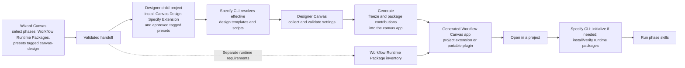

# Architecture draft: consistent customization of the Designer Canvas and Generated Workflow Canvas app

## 1. Terminology

These terms identify different products and phases of the journey. In particular, a **Copilot canvas**, a **Specify extension**, and a **Specify preset** are not the same thing.

| Term used here | What it is | Where it runs or is installed |
| --- | --- | --- |
| **Wizard Canvas** | The Copilot canvas where the user selects workflow phases, packages, and design customizations. | Provided by the `spec-kit-copilot-wizard` **Copilot plugin**. |
| **Designer Canvas** | The Copilot canvas where the user configures and generates a workflow canvas. | Also provided by the Wizard Copilot plugin, but opened in a separate Designer child session. |
| **Canvas Design Specify Extension** | `extension-canvas-design`: a **Specify CLI extension** that supplies Designer page templates, commands, schemas, and generation source. | Installed in the Designer child project for design and generation. It is **not** the Designer Canvas provider. |
| **Canvas Design Presets** | Approved **Specify presets tagged `canvas-design`**, selected in the Wizard Canvas to customize the Canvas Design Specify Extension’s templates, commands, or scripts. | Installed and resolved in the Designer child project. The effective contributions needed at runtime are **packaged into the Generated Workflow Canvas app**; the presets themselves do **not** need to be installed in a project running that app. |
| **Workflow Runtime Packages** | Specify presets, extensions, and bundles selected for the workflow pipeline and its phase skills. | Currently reproduced in the Designer child checkout; needed as applicable in each project that runs the workflow. They are distinct from Canvas Design Presets. |
| **Specify CLI** | The `specify` executable used to initialize projects, install/resolve Specify packages, and support Spec Kit workflows. | Required for Designer-child operations and, as applicable, for project setup and workflow execution when using a portable Generated Workflow Canvas app. |
| **Generated Workflow Canvas app** | The runnable canvas produced by Generate. Today it is a Copilot **project extension** in `.github/extensions/<canvas-id>/`; its proposed portable form is its own **Copilot plugin**. | Opens against a project containing—or able to set up—its required workflow environment. Its generated-host pages, controls, assets, and behavior are packaged **inside the app**. |

**Packaging clarification:** Generate writes the resolved design contributions needed at runtime **into the Generated Workflow Canvas app itself**. It does not write references that require the originating Canvas Design Presets to be installed later. A project running the finished app therefore does **not** install those `canvas-design`-tagged presets to render its customizations. It may still need the **Specify CLI** and separate **Workflow Runtime Packages** to set up and run workflow phases.

The `canvas-design` tag identifies Specify presets offered for **customizing the design** in the Wizard Canvas. The tag does not itself register a page, run a script, or make a preset a workflow prerequisite. Registration and resolution remain explicit. If a package also has a Workflow Runtime Package role, that role must be declared and handled separately; do not infer it solely from the tag.

## 2. Goals and the design-time/runtime boundary

Evolve the **Wizard Canvas → Designer Canvas → Generate → Generated Workflow Canvas app** journey with three goals:

1. **Consistent customization:** Contributors use the same authoring concepts for the Designer Canvas and Generated Workflow Canvas app—named contributions, host targets, pages, slots, controls, value contracts, precedence, validation, and diagnostics.
2. **Shared extensibility:** The Canvas Design Specify Extension supplies its stock controls and presentation through the same contracts used by approved **Canvas Design Presets tagged `canvas-design`**. A preset can introduce a previously unknown control type for either host or both.
3. **Packaged design contributions:** In the Designer child, the Specify CLI resolves the effective extension and tagged-preset templates/scripts. Generate validates and **packages the resulting generated-host code, assets, and configuration into the Generated Workflow Canvas app**. The finished app does **not** need `extension-canvas-design` or the originating `canvas-design`-tagged presets installed to render those contributions.

**The Specify CLI can still be required.** A portable Generated Workflow Canvas app uses it, as needed, to initialize its active project, install or verify **Workflow Runtime Packages**, and run the selected phase skills. Not needing the *Canvas Design Specify Extension* is not the same as not needing the *Specify CLI*.



The current Designer child also installs and verifies the handoff’s Workflow Runtime Packages in **its own checkout** before opening the Designer Canvas. Preserve that functioning path while adding portability. Those installations do not become part of the generated plugin merely because the plugin was produced in the same checkout.

## 3. One contribution model for both customizable canvases

Each contribution has a stable ID, contract version, target host (`designer`, `generated`, or `both`), registration or slot target, capabilities, dependencies, and provenance. A **Canvas Design Preset tagged `canvas-design`** can contribute to either host through the same explicit composition model.

| Operation | Designer Canvas | Generated Workflow Canvas app | Common rule |
| --- | --- | --- | --- |
| **Add a page** | Register a named settings tab. | Register a named navigable page. | Explicitly select the host; one does not create the other. |
| **Add page content** | Add fields or controls to an ordered page slot. | Add controls to an ordered page or shell slot. | Same slot targeting, order, replacement, and collision rules. |
| **Replace a default** | Replace a named page, slot item, or control. | Replace a named page, slot item, or presentation. | Same explicit target ID and preset precedence; shell invariants remain protected. |
| **Provide a value** | Collect a typed input or configure a value source. | Consume a frozen value or run its packaged provider. | Same field ID, type, scope, ownership, and diagnostics. |
| **Provide a control type** | Supply a Designer adapter if rendered here. | Supply a generated adapter if rendered here. | Same control ID and capability contract; the adapters may differ. |
| **Provide behavior** | Configure or preview a feature. | Render it or request an allowed shell action. | Same contribution identity; privileged execution remains shell-owned. |

A tagged preset can register a **control type previously unknown to either canvas**. To render in both, it supplies a Designer adapter, a generated adapter, and a compatible typed value or action contract. A Designer adapter does not automatically render in the generated host. Missing adapters, incompatible schemas, or unavailable host capabilities produce clear errors—not an unrelated fallback widget.

The **Canvas Design Specify Extension is the base contributor under these same rules**. Its standard text and checkbox controls, future Logo and Setup confirm controls, and default pipeline presentation should not use a separate, hard-coded control architecture.

**Specify’s role:** Specify already supports overriding and composing **commands, scripts, and templates**; templates can carry the JSON and other files this architecture needs. Specify resolves the effective named files. The **Canvas Design integration** interprets their contents as slots, fields, controls, and adapter registrations; Specify does not need a native “slot” or “control” feature.

**Resolution remains explicit.** Today, an additional Designer tab requires a named page template *and* a name in the composed `load-page` command’s **Additional Designer pages** section. Extend that principle to slot contributions and generated-host assets. The `canvas-design` tag helps the Wizard identify relevant presets; it is not an instruction to scan every file within them.

## 4. Essentials: two required fields, optional contributions

The core Essentials page (`canvas-settings-setup`) in the **Designer Canvas** contains only:

| Required field | Invariant |
| --- | --- |
| `canvas.id` | Valid, non-reserved Generated Workflow Canvas app ID. |
| `canvas.displayName` | Nonblank canvas name/title. |

Generate requires these two fields unconditionally. A tagged preset replacing the entire Essentials page must retain compatible definitions for them.

The **Canvas Design Specify Extension** places its other stock options into an ordered Essentials slot:

| Optional stock contribution | Designer Canvas control | Generated Workflow Canvas app binding | If absent |
| --- | --- | --- | --- |
| `canvas.description` | Text | Collection description | Existing default description. |
| `canvas.workflowListName` | Text | Collection heading | “Workflows.” |
| `workflowSlug.userProvided` | Checkbox | Custom-slug availability | `false`. |
| **Upcoming:** `canvas.logo` | Image upload/preview | Header image | Existing brand mark. |
| **Upcoming:** `setup.confirm` | Checkbox | Project-setup trigger | Automatic mode when portable setup exists. |

A **Canvas Design Preset tagged `canvas-design`** can add `billing.costCode` to that slot or to a separately registered Billing tab. Its generated consumer uses the same field ID either way.

**This slot mechanism needs to be implemented in the Canvas Design integration.** Specify can resolve the files containing slot definitions and contributions; the Designer Canvas will validate and apply their meaning. Currently, composition can replace a whole Designer page or explicitly add one; it does not automatically merge an individual field into Essentials. Use named, ordered slot contributions—not implicit JSON-array merging.

## 5. Values, controls, pages, and shell actions

A field’s **ID, validated schema, value source, scope, editing control, and generated presentation** are distinct. Each field ID has one value owner.

| Value source | Example | Treatment |
| --- | --- | --- |
| Designer Canvas input | Cost code; Setup confirm | Validate and freeze typed value into the app. |
| Designer Canvas asset | Logo | Validate image, freeze bytes/hash, package it into the app. |
| Tagged preset constant | Fixed organizational value | Freeze typed value and provenance into the app. |
| Packaged runtime value provider | Value derived from selected workflow | Package the effective provider module into the app; validate its runtime result. |

Presentation can be read-only, runtime-editable with shell-owned persistence, or not automatic. A processing-only value can still be read by a declared page or action; that is **not** a secrecy mechanism. Runtime providers must not perform side effects during refresh.

A **Generated Workflow Canvas app page** is registered independently of a Designer Canvas tab. Adding Billing to Designer does not add a generated Billing page; adding a generated Billing page does not require a Designer Billing tab.

The source-owned **Generated Workflow Canvas app shell** owns authentication, navigation, workflow context, state/revisions, project readiness, privileged setup, phase execution, tracking, and artifacts. Contributed controls and pages receive a versioned API for declared values, assigned slots, validated edits, and permitted actions. Replacing the pipeline visualization cannot replace phase-dispatch safeguards.

## 6. Resolve during design; package contributions into the app

The **Canvas Design Specify Extension** and approved **Canvas Design Presets tagged `canvas-design`** are installed in the Designer child project. The **Specify CLI** composes their effective commands, templates, and scripts. The Designer Canvas loads and validates that result.

At Generate:

1. Validate values from **all enabled, successfully resolved Designer pages**, separately enforcing the two required identity fields.
2. Resolve and validate effective slot definitions, control adapters, generated pages, providers, presentation modules, and all declared assets/dependencies.
3. Freeze definitions, values, asset/module bytes and hashes, selected phases, Workflow Runtime Package requirements, and provenance in a bounded request.
4. Have `scripts/generate.mjs` verify the request and **write the effective generated-host adapters, provider modules, pages, presentation modules, assets, and configuration into the Generated Workflow Canvas app**, alongside the maintained shell.
5. Verify that the app uses **its packaged files**, not paths into the Designer child’s `.specify` directory.

Generated configuration remains derived from the frozen request; there is no competing preset-replaceable generated-config template. Changes to a source preset do not alter an app that was already generated.

**Design-time dependency acceptance test:** Package the Generated Workflow Canvas app as its own Copilot plugin and open it in a project **without** `extension-canvas-design` or the originating `canvas-design`-tagged presets. Its packaged pages, controls, providers, assets, and presentation still work. The app does not run `specify preset resolve` for design contributions at launch. It can still use the **Specify CLI for workflow project setup**.

## 7. Stock Logo and Setup confirm

**Logo** is a stock asset/control contribution from the **Canvas Design Specify Extension**. A Designer adapter supports upload, preview, replace, and remove; Generate validates and packages the image and generated header adapter **inside the Generated Workflow Canvas app**. On launch, the app reads its packaged image or uses the existing brand mark; it does not ask the project to install Canvas Design.

**Setup confirm** is a stock boolean/control contribution from the **Canvas Design Specify Extension**. The Designer Canvas displays a checkbox. Generate packages its value and the generated setup-control behavior **inside the app**. The checkbox selects when to invoke **one shell-owned project-setup operation**:

| Value | If the active project needs workflow setup |
| --- | --- |
| **On** | Show required work and a **Set up project** button; start when clicked. |
| **Off or absent** | Start during canvas load; show progress, permission requests, and failures. |

That operation inspects the active project, ensures the **Specify CLI** is available, runs `specify init` in Copilot skills mode if needed, installs or reconciles **Workflow Runtime Packages**, verifies phase skills, and reloads skills when required. It does **not** install the design-time Canvas Design Specify Extension or `canvas-design`-tagged presets merely to render their already-packaged controls.

An already-correct project is verified rather than reinstalled. Failed or partial setup stays visible and retryable; dependent phases remain unavailable until their requirements are verified. The current handoff inventory is not necessarily a complete portable installation recipe, so plugin setup also requires frozen, approved source and bundle information—never a guessed source from a package ID.

## 8. Acceptance criteria

| Scenario | Required result |
| --- | --- |
| **Minimal Essentials** | Generate succeeds with valid Canvas ID and name alone; invalid/missing core identity blocks it clearly. |
| **Optional stock controls** | Description, Workflow header, and Allow custom slug are supplied by base contributions and preserve current default UX; removing one applies its declared fallback. |
| **Cost code on Essentials** | A `canvas-design`-tagged preset adds it to an Essentials slot without replacing the entire page; its value reaches a generated read-only control. |
| **Cost code on Billing tab** | The preset explicitly registers a Designer Billing page. Its saved value produces the same generated result as on Essentials; an unregistered file adds no tab. |
| **Designer-only/generated-only pages** | Either can be declared independently. A Designer Billing tab does not implicitly create a Generated Workflow Canvas app Billing page. |
| **Generated Billing page** | It navigates and reads `billing.costCode` by ID regardless of its Designer location. |
| **Fixed/computed/processing-only value** | Fixed provenance survives Generate; workflow-scoped results update; invalid providers fail visibly; processing-only values do not appear in generic Details. |
| **Previously unknown control type** | A `canvas-design`-tagged preset supplies Designer and generated adapters; both render through the same control ID without new hard-coded host switch cases. Missing/incompatible adapters fail consistently. |
| **Runtime edit** | Valid edits persist; invalid/conflicting edits fail; frozen initial value does not overwrite later changes. |
| **Stock Logo** | Valid image survives Generate and plugin launch without design-time packages; absence uses fallback; invalid input fails. |
| **Stock Setup confirm** | On waits for click; Off starts needed setup on load. Both verify and report results; setup targets Workflow Runtime Packages, not Canvas Design inputs. |
| **Pipeline replacement** | Presentation changes while shell-owned phase execution and artifact safeguards remain intact. |
| **Design-time dependency separation** | The finished app opens and renders its packaged pages, adapters, providers, and assets without `extension-canvas-design` or the originating `canvas-design`-tagged presets installed in the active project. |
| **Specify CLI dependency** | In a fresh project, setup checks for the Specify CLI, initializes Spec Kit as needed, installs/verifies Workflow Runtime Packages, and reloads skills before dependent phases run. |
| **Consistent customization** | One sample preset demonstrates Designer-only, generated-only, and paired contributions under the same registration, slot, precedence, validation, and diagnostic conventions. |

## 9. Implementation sequence

1. **Define the versioned contribution specification:** IDs, host targets, pages/slots, ordering, replacement/disable behavior, types, adapters, capabilities, dependencies, provenance, and diagnostics.
2. **Add Designer Canvas page-slot composition:** retain explicit named-page resolution; reduce core Essentials to ID and name; move current optional stock fields into base-extension contributions without changing the default UX.
3. **Introduce both host control registries:** migrate base text/checkbox and generated presentations to the same registration path available to `canvas-design`-tagged presets; test a previously unknown paired control.
4. **Generalize Designer validation and generation:** update Designer `ui/app.js` and `generation.mjs` to freeze all present enabled fields from all pages while retaining the two identity invariants.
5. **Package effective design contributions into the app:** extend `scripts/generate.mjs` and the maintained Generated Workflow Canvas app runtime/UI to write generated adapters, providers, pages, modules, and assets into the app. Verify startup without design-time packages.
6. **Add stock Logo and Setup confirm** through those reusable asset and control/action contracts, not through new Essentials-only whitelist branches.
7. **Add standalone-plugin packaging and active-project setup:** preserve current project-extension output; freeze reproducible Workflow Runtime Package sources; check the Specify CLI and project scaffolding; implement both setup triggers, verification, skill reload, and phase gating.
8. **Run end-to-end scenario tests:** begin with Wizard Canvas selection of a `canvas-design`-tagged preset; resolve it using Specify in the Designer child; configure it in the Designer Canvas; Generate; and open the Generated Workflow Canvas app both in its original checkout and as a plugin in another project.

**Architectural completion test:** The Generated Workflow Canvas app contains the **packaged result** of the Canvas Design Specify Extension and selected `canvas-design`-tagged Specify presets. It does **not** need those design-time packages installed where it runs. It **does** use the Specify CLI and required Workflow Runtime Packages to set up and execute its selected workflow in the active project.

## 10. What an adapter is

An **adapter** is JavaScript supplied for a particular control or presentation **in one canvas**. A control definition describes its stable ID, supported value schema, host capabilities, and adapter IDs. Multiple fields can reuse one control and adapter; a new field does not necessarily need new JavaScript.

| Adapter | Runs in | Responsibility |
| --- | --- | --- |
| **Designer control adapter** | Designer Canvas | Render an editor or preview and report draft changes to the Designer Canvas. |
| **Generated control adapter** | Generated Workflow Canvas app | Display or interact with a declared field using the app’s permitted APIs. |
| **Value-provider module** | Generated app runtime | Return a validated value for a declared field, using permitted context such as selected workflow. |
| **Feature/presentation adapter** | Usually the generated app | Render a larger feature such as the pipeline. It requests actions from the shell rather than executing them itself. |

For a control targeting **both** canvases, provide an adapter for each host. The two adapters share a control ID and value contract; they may render differently. A Cost code might be a text input in Designer and a read-only badge in the generated app.

In the earlier example, **“host” meant the canvas code that mounts the adapter and supplies a controlled API**. To avoid ambiguity, call these the **Designer adapter API** and the **Generated-app adapter API**:

- The **Designer adapter API** lets an adapter receive its field definition and draft value, then request a draft change. The Designer Canvas validates and saves the setting.
- The **Generated-app adapter API** lets an adapter read declared field values, observe relevant context, and request permitted shell actions. The generated shell validates and executes those actions.

Neither API is a current repository feature. A proposed lifecycle could have `mount`, `update`, and `dispose` operations, but its exact signatures must be specified and tested before preset authors depend on it. Adapters must not receive unrestricted project filesystem access or a raw Copilot session object.

## 11. What a slot is

A **slot is a named insertion point declared by an existing page or shell layout**. It is not a page, field value, or control type.

```text
Designer Canvas → Essentials page
  Canvas ID                     required core field
  Canvas name                   required core field
  [essentials.options]          declared slot
    Description                 base-extension contribution
    Allow custom slug           base-extension contribution
    Cost code                   preset contribution
```

The Generated Workflow Canvas app could declare slots such as `header.brand` for logo presentation or `details.content` for read-only fields.

A contributor does **not** invent an arbitrary slot name. The page or shell publishes a slot contract describing its **exact ID, location, owning host, accepted contribution kinds, available adapter API/context, ordering rules, and limits**. The contribution names that slot and supplies an accepted item. An unknown slot or incompatible item is an error.

A preset-provided page may declare its **own** slots. If no existing slot suits a customization, the preset can add a page or explicitly replace a page layout rather than insert UI at an undocumented location. A documented, inspectable slot catalog is part of the proposed implementation.

## 12. Source files, templates, and packaged app files

### Current locations

```text
plugins/spec-kit-copilot-wizard/
  plugin.json
  extensions/
    speckit-wizard-canvas/             Wizard Canvas provider
    speckit-canvas-designer/           Designer Canvas provider
      pages.mjs                        loads resolved pages
      settings.mjs                     validates and saves settings
      generation.mjs                   freezes today's Essentials-only request
      ui/app.js                        today's text/checkbox renderer

spec-kit-extensions/extension-canvas-design/
  extension.yml
  commands/load-page.md
  commands/generate.md
  pages/essentials.json                currently contains five fields
  pages/artifacts.json                 currently empty placeholder
  pages/appearance.json                currently empty placeholder
  schemas/page.schema.json             currently string/boolean fields
  scripts/generate.mjs
  templates/generated-canvas/
    extension.mjs
    server.mjs
    runtime.mjs
    contract.mjs
    ui/app.js
    ui/*.css
```

### Proposed Canvas Design Specify Extension additions

```text
spec-kit-extensions/extension-canvas-design/
  extension.yml
  commands/
    load-page.md
    generate.md
  pages/
    essentials.json                    core ID/name fields; optional-field slot
    artifacts.json                     phase-output review slot
    appearance.json                    palette/theme slot
  contributions/
    stock-essentials.json              optional Essentials fields
    stock-artifacts.json               Artifacts page control registration
    stock-appearance.json              Appearance page control registration
    stock-generated.json               default generated slots/features
  controls/
    text/
      control.json
      designer.mjs
      generated.mjs                     if needed in generated host
    checkbox/
      control.json
      designer.mjs
      generated.mjs                     if needed in generated host
    phase-outputs/
      control.json
      designer.mjs                     structured Artifacts editor
    palette/
      control.json
      designer.mjs                     palette selection/preview
    image/
      control.json
      designer.mjs                     future upload/preview
      generated.mjs                    future packaged-image display
  features/
    pipeline/
      feature.json
      generated.mjs                    visualization, not phase dispatch
    project-setup/
      feature.json
      generated.mjs                    setup UI, not package installer
  schemas/
    page.schema.json
    contribution.schema.json           proposed versioned contribution schema
  scripts/generate.mjs
  templates/generated-canvas/
    extension.mjs
    server.mjs
    runtime.mjs
    ui/
      app.js
      control-host.mjs                 mounts packaged adapters
```

The **Designer Canvas provider and adapter API** remain in the Wizard Copilot plugin. The Canvas Design Specify Extension holds the **stock adapter source and definitions** to be resolved during design. Generate copies the effective modules/assets needed by the Generated Workflow Canvas app; it does not copy the entire Specify extension into the app.

### Proposed Canvas Design Preset layout

```text
copilot-billing-canvas/
  preset.yml                           tagged canvas-design
  commands/load-page.md                explicitly names added contributions
  pages/billing.json                   additional Designer page
  contributions/billing.json           field, slot, and generated bindings
  controls/cost-code/
    control.json
    designer.mjs
    generated.mjs
  pages-generated/
    billing.json                       generated page definition
    billing.mjs                        generated page renderer
```

These paths are a proposed package convention. **Files do not become active merely by being present.** The composed commands and manifests must explicitly identify names to resolve.

### Proposed generated-app layout

```text
.github/extensions/<canvas-id>/          current project-extension destination
  extension.mjs
  server.mjs
  runtime.mjs
  canvas-config.json
  canvas-setup.json
  contributions/registry.json           frozen effective registrations
  controls/billing-cost-code/
    generated.mjs                        copied effective generated adapter
  pages/billing.mjs                      copied effective generated page
  assets/logo.png                        if a logo was selected
  ui/
    app.js
    control-host.mjs
    *.css
```

For the future standalone Copilot plugin, those app files would be placed under its `extensions/<canvas-id>/` directory with a plugin-level `plugin.json`. The generated app imports its **own packaged modules**, not modules in the Designer child’s `.specify` directory.

## 13. Illustrative JSON contracts

These examples describe the **proposed Canvas Design contract**, not the current `page.schema.json`. Specify can resolve the JSON templates; the Designer Canvas interprets and validates their contents.

Core Essentials defines the required fields and a documented slot:

```json
{
  "schemaVersion": 2,
  "id": "canvas-settings-setup",
  "title": "Essentials",
  "slots": [
    {
      "id": "essentials.options",
      "accepts": ["field"],
      "orderBy": ["order", "id"]
    }
  ],
  "fields": [
    { "id": "canvas.id", "type": "string", "control": "stock.text", "label": "Canvas ID" },
    { "id": "canvas.displayName", "type": "string", "control": "stock.text", "label": "Canvas name" }
  ]
}
```

An optional stock field targets that slot:

```json
{
  "schemaVersion": 1,
  "id": "stock.workflow-slug-option",
  "host": "designer",
  "slot": "essentials.options",
  "order": 30,
  "field": {
    "id": "workflowSlug.userProvided",
    "type": "boolean",
    "label": "Allow custom slug",
    "control": "stock.checkbox",
    "source": "designer",
    "default": false
  },
  "generatedBinding": {
    "feature": "stock.workflow-slug",
    "presentation": "configured"
  }
}
```

A control definition can name adapters by **Specify-resolvable IDs** rather than arbitrary paths supplied to the generated app:

```json
{
  "schemaVersion": 1,
  "id": "billing.cost-code",
  "accepts": { "type": "string", "maxLength": 40 },
  "adapters": {
    "designer": "canvas-control-billing-code-designer",
    "generated": "canvas-control-billing-code-generated"
  },
  "generatedCapabilities": ["readField"]
}
```

Specify resolves those named files in the Designer child. Generate freezes and packages the **generated** adapter. The generated app’s registry then names its **packaged local module**; it does not resolve the Specify name again when the app launches.

The Canvas Design schemas should distinguish **ordinary fields**, **asset fields** such as Logo, and **feature settings** such as Setup confirm. A slot declares which kinds it accepts; providing JSON does not grant a page arbitrary capabilities.

## 14. Canonical Billing example, including the composed command

This is a **proposed sample preset to build and test**, not an example already present in the repository.

1. In the **Wizard Canvas**, the user selects the approved Specify preset tagged `canvas-design` named `copilot-billing-canvas`.
2. In the **Designer child**, Specify installs and composes that preset with the Canvas Design Specify Extension. The preset appends instructions to the existing `load-page` command.
3. The **composed command** explicitly names the Billing Designer page and Billing contribution assets. The base command resolves every named item through Specify and opens the Designer Canvas once with the complete resolved set.
4. In the **Designer Canvas**, the Billing tab renders `billing.costCode` with the preset’s Designer adapter. The Designer adapter API receives the definition and draft value; the adapter requests changes, while the Designer validates and saves them.
5. At **Generate**, the generator freezes the value, definitions, effective generated adapter, generated Billing page module, hashes, and provenance. It writes the generated adapter and page **into the Generated Workflow Canvas app**.
6. The **Generated Workflow Canvas app** registers its packaged Billing page, reads `billing.costCode` through its field API, and mounts its packaged generated adapter.
7. When opened elsewhere as a standalone Copilot plugin, Billing still works **without installing `copilot-billing-canvas` into that project**. Specify CLI and Workflow Runtime Packages remain separate requirements for running phases.

The preset’s proposed `commands/load-page.md` content is **an addition to the existing command**, not a second copy of the complete load workflow:

```markdown
## Additional Designer pages

- `canvas-settings-billing`

## Additional Canvas Design templates

- `canvas-contributions-billing`
- `canvas-control-billing-code`
- `canvas-page-billing-generated`

## Additional Canvas Design scripts

- `canvas-control-billing-code-designer`
- `canvas-control-billing-code-generated`
- `canvas-page-billing-generated-renderer`

## Billing resolution requirements

Resolve every name above using the base command's resolution steps from the
Designer child project root. Do not use files directly from this preset's source
directory or infer their paths from the names.

The resolved `canvas-contributions-billing` definition must refer to the resolved
Billing page, control definition, generated page, and adapter IDs above. Missing
or conflicting names must stop the Designer open; do not omit Billing and report
the complete design as ready.
```

The **base** `extension-canvas-design/commands/load-page.md` must be extended beyond its current page-only behavior. Its proposed resolution instructions are:

```markdown
Read the entire composed command. Collect the three default Designer page names
and every name in all Additional Designer pages, Additional Canvas Design
templates, and Additional Canvas Design scripts sections. Deduplicate each named
registration; reject conflicting kinds or IDs.

From the Designer child project root, run the following for EACH collected name:

    specify preset resolve <name>

Inspect both output and exit status. Match the exact `<name>:` output prefix to
obtain its complete resolved path; do not construct a path from the name, scan
.specify, or substitute a base-extension file. Stop on not found, ambiguity,
composition warnings, or command errors—even if a missing result has exit code 0.

Validate the resolved files against their declared kinds, sizes, locations,
schemas, referenced IDs, and required host adapters. Only after the entire set
resolves and validates, open the official Designer Canvas ONCE with the complete
resolved page and contribution inventory.
```

This extends a **working current pattern**: the existing base command already calls `specify preset resolve` for each named Designer page. It does **not yet** collect the proposed template/script sections. The Designer Canvas open input also currently accepts resolved **page paths only**; it must evolve to accept the complete resolved contribution inventory.

The command does **not** scan preset directories. Names in its sections must correspond to files exposed by the extension or preset manifests. Resolving a name does **not** render a control by itself: the Designer Canvas interprets and validates the resolved definitions and loads the matching Designer adapter.

For example, `canvas-control-billing-code-generated` is a **design-time Specify resolution name**. Generate packages its resolved script inside the app, perhaps at `controls/billing-cost-code/generated.mjs`. At launch, the app loads **that local file**, not the Specify resolution name.

A production adapter API should bind the field ID through its definition rather than require adapter code to repeat `billing.costCode`. Both host adapters must satisfy the same typed control contract.

## 15. What `extension.yml` and `preset.yml` would look like

Specify already supports overrides and composition of **commands, scripts, and templates**. Templates can carry the JSON and other files needed here. The new **slot, field, control, and adapter semantics are implemented by Canvas Design**, not by a new Specify feature.

The examples below show which files each manifest would expose. Their new names and Canvas Design JSON schemas are proposed; the implementation should use Specify’s supported declaration and composition syntax for the chosen file kind. It must not assume JSON-array structural merging.

### Canvas Design Specify Extension

```yaml
schema_version: "1.0"

extension:
  id: extension-canvas-design
  name: Canvas Design
  version: "<next-extension-version>"
  description: Default contributions for Designer and generated workflow canvases.
  category: process
  author: spec-kit-copilot
  repository: https://github.com/nicolehaugen/spec-kit-copilot
  license: MIT

requires:
  speckit_version: ">=1.0.7"

provides:
  commands:
    - name: speckit.extension-canvas-design.load-page
      file: commands/load-page.md
      description: Resolve named design contributions and open Designer.
    - name: speckit.extension-canvas-design.generate
      file: commands/generate.md
      description: Materialize the validated frozen canvas app.
  templates:
    - name: canvas-settings-setup
      file: pages/essentials.json
      description: Required canvas identity fields and Essentials slot.
    - name: canvas-settings-artifacts
      file: pages/artifacts.json
      description: Artifacts page and phase-output review slot.
    - name: canvas-settings-appearance
      file: pages/appearance.json
      description: Appearance page and palette slot.
    - name: canvas-contributions-stock-essentials
      file: contributions/stock-essentials.json
      description: Optional stock Essentials fields.
    - name: canvas-contributions-stock-artifacts
      file: contributions/stock-artifacts.json
      description: Default phase-output editor contribution.
    - name: canvas-contributions-stock-appearance
      file: contributions/stock-appearance.json
      description: Default palette editor contribution.
    - name: canvas-contributions-stock-generated
      file: contributions/stock-generated.json
      description: Default generated-host contributions.
  # Register stock adapters and feature scripts under stable Specify names
  # through its supported script mechanism.

tags:
  - copilot
  - canvas-design
```

### Billing Canvas Design Preset

```yaml
schema_version: "1.0"

preset:
  id: copilot-billing-canvas
  name: Copilot Billing Canvas
  version: "1.0.0"
  description: Adds Billing settings and generated-canvas presentation.
  author: "<preset-author>"
  repository: "<preset-repository>"
  license: MIT

requires:
  speckit_version: ">=1.0.7"
  extensions:
    - extension-canvas-design

provides:
  templates:
    - type: "command"
      name: "speckit.extension-canvas-design.load-page"
      file: "commands/load-page.md"
      replaces: "speckit.extension-canvas-design.load-page"
      strategy: "append"
    # Expose the named Billing page, contribution/control/page templates,
    # and Designer/generated adapter scripts named in the command above,
    # using Specify's supported template and script declarations.

tags:
  - copilot
  - canvas-design
  - billing
```

The appended command names what the base `load-page` command must resolve. The `canvas-design` tag makes the preset discoverable in the Wizard Canvas; it does **not** activate Billing by itself. **Specify resolves effective files; the Canvas Design integration interprets them.**

## 16. How Artifacts and Appearance fit

The existing `canvas-settings-artifacts` and `canvas-settings-appearance` JSON files are currently **enabled Designer pages with empty `fields` arrays**. Their intended behavior fits the same page, slot, control, value, and generated-binding architecture. They are Designer pages—not automatically pages in the Generated Workflow Canvas app.

| Page | Proposed stock Designer contribution | What Generate packages into the app |
| --- | --- | --- |
| **Artifacts** | A structured **phase-output editor** in an Artifacts page slot. It starts with output information handed off from the Wizard Canvas. The person configuring the canvas can remove an incorrect expected output, add a missing one, and select the default reader target for each phase with outputs. | Validated expected-output lists and one selected default viewer target per phase. The generated shell still owns artifact-path authorization, placeholder resolution, and file reads. |
| **Appearance** | A **palette editor/preview** in an Appearance page slot. It configures colors for the overall Generated Workflow Canvas app; Logo can remain on Essentials. | Validated palette/theme values and any needed packaged assets. The generated app applies them without reinstalling Canvas Design Presets. |

### Artifacts: handoff and separate-PR dependency

The **Wizard output list is being added in a separate PR**. This architecture **consumes that handoff information once available**; it does not assign this plan ownership of producing or inferring the Wizard’s output list. The integration contract must specify phase IDs, expected output paths or patterns, any recommended default, and provenance. Tests may use a fixture for that contract until the other PR is integrated.

The Artifacts editor shows **expected outputs**, not files that necessarily exist already. For each Wizard-selected phase, the person configuring the Designer Canvas can correct the incoming list:

- Remove an incorrect entry.
- Add a missing output, subject to path/type validation.
- Select **one default reader target** from that phase’s remaining outputs.
- Leave a phase with no outputs and therefore no viewer default.

Removing the selected default clears that selection; if outputs remain, another default must be selected before Generate. The generated app’s existing per-phase `phaseArtifacts` concept (`outputs` plus `view`) is a suitable target for the confirmed result, but the generator currently writes an empty mapping. The generated shell must continue to confine paths to the appropriate project/workflow and report when a confirmed expected artifact has not yet been created.

**Acceptance:** Artifacts displays the output list received through the Wizard handoff rather than independently inventing one in Designer or Generate. Edits and per-phase defaults survive Generate. The generated reader opens the confirmed default when it exists; unsafe paths or a default not in the phase’s output list are rejected.

### Appearance: palette and existing light/dark button

The **Generated Workflow Canvas app already has a light/dark button in its header**. That is an end-user runtime theme choice, not an Appearance page setting.

The proposed Appearance editor lets the canvas creator select or configure a validated **palette for the app**. Its contract must say how that palette applies in **both light and dark modes**, so the existing button can still switch modes without discarding the chosen visual identity. A preset could contribute another palette or a compatible palette-editing control. The editor should preview the resulting colors in Designer; Generate freezes the chosen tokens/assets into the app.

**Acceptance:** Palette choices survive Generate and reopen, apply consistently throughout the app in light and dark mode, retain readable contrast, and do not require the originating Canvas Design Preset in the project running the finished app.

## 17. Implementation and verification implications

These details extend the implementation sequence in section 9; they do not replace its goals:

1. Specify the **Designer adapter API**, **Generated-app adapter API**, and adapter lifecycle before asking presets to supply JavaScript.
2. Publish slot contracts so contributors know which IDs exist, what they accept, and how items are ordered. Reject unknown or incompatible targets.
3. Use Specify’s command, script, and template composition to resolve the named files. Have Canvas Design validate the effective JSON and module contracts; do not assume Specify structurally merges JSON fields.
4. Freeze **resolved module bytes and declared transitive assets**, not only paths or preset IDs. Validate hashes when generating.
5. Treat the Wizard output-list PR as an **interface dependency** for Artifacts. Integrate its handed-off output data when available; do not substitute generator defaults and call them Wizard output.
6. Test the generated app with design-time Canvas Design Specify Extension and tagged presets **absent**, while testing Specify CLI/Workflow Runtime Package readiness separately.

**Expanded architectural completion test:** Select a `canvas-design`-tagged Billing preset in the Wizard Canvas; resolve it in the Designer child; edit Cost code in the Designer Canvas; review and correct Wizard-handoff outputs on Artifacts; choose a palette on Appearance; Generate. The Generated Workflow Canvas app then renders its **packaged** Billing control, confirmed viewer defaults, and selected palette without installing the Billing or Canvas Design design-time packages in the project where it opens.