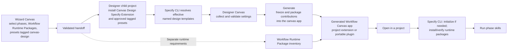

# Architecture draft: consistent customization of the Designer Canvas and Generated Workflow Canvas app

## 1. Terminology

These terms identify different products and phases of the journey. In particular, a **Copilot canvas**, a **Specify extension**, and a **Specify preset** are not the same thing.

| Term used here | What it is | Where it runs or is installed |
| --- | --- | --- |
| **Wizard Canvas** | The Copilot canvas where the user selects workflow phases, packages, and design customizations. | Provided by the `spec-kit-copilot-wizard` **Copilot plugin**. |
| **Designer Canvas** | The Copilot canvas where the user configures and generates a workflow canvas. | Also provided by the Wizard Copilot plugin, but opened in a separate Designer child session. |
| **Canvas Design Specify Extension** | `extension-canvas-design`: a **Specify CLI extension** that supplies Designer page templates, commands, schemas, and generation source. | Installed in the Designer child project for design and generation. It is **not** the Designer Canvas provider. |
| **Canvas Design Presets** | Approved **Specify presets tagged `canvas-design`**, selected in the Wizard Canvas to customize the Canvas Design Specify Extension’s templates, commands, or scripts. | Installed and resolved in the Designer child project. The effective contributions needed at runtime are **packaged into the Generated Workflow Canvas app**; the presets themselves do **not** need to be installed in a project running that app. |
| **Workflow Runtime Packages** | Specify presets, extensions, and bundles selected for the workflow pipeline and its phase skills. | Currently reproduced in the Designer child checkout; needed as applicable in each project that runs the workflow. They are distinct from Canvas Design Presets. |
| **Specify CLI** | The `specify` executable used to initialize projects, install/resolve Specify packages, and support Spec Kit workflows. | Required for Designer-child operations and, as applicable, for project setup and workflow execution when using a portable Generated Workflow Canvas app. |
| **Generated Workflow Canvas app** | The runnable canvas produced by Generate. Today it is a Copilot **project extension** in `.github/extensions/<canvas-id>/`; its proposed portable form is its own **Copilot plugin**. | Opens against a project containing—or able to set up—its required workflow environment. Its generated-host pages, controls, assets, and behavior are packaged **inside the app**. |

**Packaging clarification:** Generate writes the resolved design contributions needed at runtime **into the Generated Workflow Canvas app itself**. It does not write references that require the originating Canvas Design Presets to be installed later. A project running the finished app therefore does **not** install those `canvas-design`-tagged presets to render its customizations. It may still need the **Specify CLI** and separate **Workflow Runtime Packages** to set up and run workflow phases.

The `canvas-design` tag identifies Specify presets offered for **customizing the design** in the Wizard Canvas. The tag does not itself register a page, run a script, or make a preset a workflow prerequisite. Registration and resolution remain explicit. If a package also has a Workflow Runtime Package role, that role must be declared and handled separately; do not infer it solely from the tag.

## 2. Goals and the design-time/runtime boundary

Evolve the **Wizard Canvas → Designer Canvas → Generate → Generated Workflow Canvas app** journey with three goals:

1. **Consistent customization:** Contributors use the same authoring concepts for the Designer Canvas and Generated Workflow Canvas app—named contributions, host targets, pages, slots, controls, value contracts, Specify-owned file precedence, semantic validation, and diagnostics.
2. **Shared extensibility:** The Canvas Design Specify Extension and approved **Canvas Design Presets tagged `canvas-design`** share declarative field, slot, and value contracts. Stock text, checkbox, and image editors use registered control definitions and Designer adapters; visible generated presentations use generated adapters. Shell-owned behavior driven by a field value does not require a visual adapter.
3. **Packaged design contributions:** In the Designer child, the Specify CLI resolves the effective extension and tagged-preset templates, including named replace-only templates containing JavaScript adapters. Generate validates and **packages the resulting generated-host code, assets, and configuration into the Generated Workflow Canvas app**. The finished app does **not** need `extension-canvas-design` or the originating `canvas-design`-tagged presets installed to render those contributions.

**The Specify CLI can still be required.** A portable Generated Workflow Canvas app uses it, as needed, to initialize its active project, install or verify **Workflow Runtime Packages**, and run the selected phase skills. Not needing the *Canvas Design Specify Extension* is not the same as not needing the *Specify CLI*.



The current Designer child also installs and verifies the handoff’s Workflow Runtime Packages in **its own checkout** before opening the Designer Canvas. Preserve that functioning path while adding portability. Those installations do not become part of the generated plugin merely because the plugin was produced in the same checkout.

## 3. One contribution model for both customizable canvases

Each contribution has a stable ID, contract version, target host (`designer`, `generated`, or `both`), registration or slot target, capabilities, dependencies, and provenance. A **Canvas Design Preset tagged `canvas-design`** can contribute to either host through the same explicit composition model.

| Operation | Designer Canvas | Generated Workflow Canvas app | Common rule |
| --- | --- | --- | --- |
| **Add a page** | Register a named settings tab. | Register a named navigable page. | Explicitly select the host; one does not create the other. |
| **Add page content** | Add fields or controls to an ordered page slot. | Add controls to an ordered page or shell slot. | Same slot targeting, display ordering, and semantic collision rules for surviving contributions. |
| **Replace a default** | Replace the named resolved file defining a page or contribution. | Replace the named resolved file defining a page or contribution. | Specify applies whole-file replacement and precedence; shell invariants remain protected. |
| **Provide a value** | Collect a typed input or configure a value source. | Consume a frozen value or run its packaged provider. | Same field ID, type, scope, ownership, and diagnostics. |
| **Provide a control type** | Resolve its definition and Designer adapter, including stock text and checkbox. | Resolve a generated adapter for visible presentation; let shell-owned behavior consume nonvisual values. | Same control ID and value contract across hosts; adapter contexts may differ. |
| **Provide behavior** | Configure or preview a feature. | Render it or request an allowed shell action. | Same contribution identity; privileged execution remains shell-owned. |

A tagged preset can register a **control type previously unknown to either canvas**. To render in both, it supplies a Designer adapter, a generated adapter, and a compatible typed value or action contract. A Designer adapter does not automatically render in the generated host. Missing adapters, incompatible schemas, or unavailable host capabilities produce clear errors—not an unrelated fallback widget.

The **Canvas Design Specify Extension is the base contributor to declarative fields, slots, and values**. Its stock text, checkbox, and image types each have a replace-only definition and Designer adapter. A generated adapter is registered for a visual placement, not for a behavior-only setting. Canvas ID and Title use a fixed Designer identity control rather than a replaceable stock text adapter; Outputs uses a fixed phase-artifacts control. The shell enforces their presence and validity. Presets can reuse stock contracts and supply their own types, such as the risk matrix, through the same resolution path.

**Specify’s role:** Specify already supports overriding and composing **commands, scripts, and templates**, but `specify preset resolve <name>` resolves named **templates**, not native script artifacts. First-version executable Canvas Design adapters and generated page/presentation modules are `.mjs` files declared as named `provides.templates` entries (`type: template`), not `type: script` entries. Extension-provided templates have implicit replace semantics; preset-provided executable templates explicitly set `strategy: replace`. Specify applies named-file precedence and whole-file replacement; a winning `replace` replaces the lower-layer file in full. Registering a **new logical name** adds to the resolved inventory regardless of replace semantics, which affect only layers sharing that name. The **Canvas Design integration** interprets only final resolved files as slots, fields, controls, and adapter registrations; it does not replay preset stacks or arbitrate preset precedence. Specify does not need a native “slot” or “control” feature.

**Resolution remains explicit.** Today, an additional Designer tab requires a named page template *and* a name in the composed `load-page` command’s **Additional Designer pages** section. Extend that principle to slot contributions and generated-host assets. The `canvas-design` tag helps the Wizard identify relevant presets; it is not an instruction to scan every file within them.

## 4. Essentials: two required fields, optional contributions

The core Essentials page (`designer-essentials`) in the **Designer Canvas** contains only:

| Required field | Invariant |
| --- | --- |
| `canvas.id` | Valid, non-reserved Generated Workflow Canvas app ID. |
| `canvas.displayName` | Nonblank canvas name/title. |

Generate requires these two fields unconditionally. A tagged preset replacing the entire Essentials page must retain compatible definitions for them.

The **Canvas Design Specify Extension** places its other stock options into an ordered Essentials slot:

| Optional stock contribution | Designer Canvas control | Generated Workflow Canvas app binding | If absent |
| --- | --- | --- | --- |
| `canvas.description` | Text | Collection description | Existing default description. |
| `canvas.workflowListName` | Text | Collection heading | “Workflows.” |
| `workflowSlug.userProvided` | Legacy frozen value | Accepted from older Designer handoffs; generated workflows now always require an artifact folder name (slug) | Ignored. |
| **Upcoming:** `canvas.logo` | Image upload/preview | Header image | Existing brand mark. |
| **Upcoming:** `setup.confirm` | Checkbox | Project-setup trigger | Automatic mode when portable setup exists. |

A **Canvas Design Preset tagged `canvas-design`** can add `billing.costCode` to that slot or to a separately registered Billing tab. Its generated consumer uses the same field ID either way.

**This slot mechanism needs to be implemented in the Canvas Design integration.** Specify can resolve the files containing slot definitions and contributions; the Designer Canvas will validate and apply their meaning. Currently, composition can replace a whole Designer page or explicitly add one; it does not automatically merge an individual field into Essentials. Use named, ordered slot contributions—not implicit JSON-array merging.

## 5. Values, controls, pages, and shell actions

A field’s **ID, validated schema, value source, scope, editing control, and generated presentation** are distinct. Each field ID has one value owner. If two distinct surviving named files define the same field ID, Designer rejects the resolved inventory and identifies both provenance names rather than choosing a winner.

| Value source | Example | Treatment |
| --- | --- | --- |
| Designer Canvas input | Cost code; Setup confirm | Validate and freeze typed value into the app. |
| Designer Canvas asset | Logo | Validate image, freeze bytes/hash, package it into the app. |
| Tagged preset constant | Fixed organizational value | Freeze typed value and provenance into the app. |
| Packaged runtime value provider | Value derived from selected workflow | Package the effective provider module into the app; validate its runtime result. |

Presentation can be read-only, runtime-editable with shell-owned persistence, or not automatic. A processing-only value can still be read by a declared page or action; that is **not** a secrecy mechanism. Runtime providers must not perform side effects during refresh.

A **Generated Workflow Canvas app page** is registered independently of a Designer Canvas tab. Adding Billing to Designer does not add a generated Billing page; adding a generated Billing page does not require a Designer Billing tab.

Designer collects and configures field values; it does not choose their generated visual layout. The base extension and tagged presets use the same declarative page/slot and field-placement contract. A field has one definition and saved value per declared scope, but may have multiple generated placements; distinct fields may share one control type and its adapters without sharing values. Generated editing is opt-in: read-only remains the default, and provider-backed fields cannot be edited. The generated shell, not a page or adapter, validates edits, revisions, and canvas-wide persistence.

The source-owned **Generated Workflow Canvas app shell** owns authentication, navigation, workflow context, state/revisions, project readiness, privileged setup, phase execution, tracking, and artifacts. Contributed controls and pages receive a versioned API for declared values, assigned slots, validated edits, and permitted actions. Replacing the pipeline visualization cannot replace phase-dispatch safeguards.

## 6. Resolve during design; package contributions into the app

The **Canvas Design Specify Extension** and selected **Canvas Design Presets tagged `canvas-design`** are installed in the Designer child project. The **Specify CLI** composes their effective commands and named templates, including its native project override behavior. The Designer Canvas consumes the resolved files and validates their content, schemas, and paths before importing or packaging executable assets and declared transitive modules. It does not compare each winning file against the handoff's approved package list or reject a file merely because Specify resolved it from a project layer. The first version adds no separate project-level adapter authoring feature or approval UI; it also does not override Specify's normal resolution behavior.

At Generate:

1. Validate values from **all enabled, successfully resolved Designer pages**, separately enforcing the two required identity fields.
2. Resolve and validate effective slot definitions, control adapters, generated pages, providers, presentation modules, and all declared assets/dependencies.
3. Freeze definitions, values, asset/module bytes and hashes, selected phases, Workflow Runtime Package requirements, and provenance in a bounded request.
4. Have `scripts/generate.mjs` verify the request and **write the effective generated-host adapters, provider modules, pages, presentation modules, assets, and configuration into the Generated Workflow Canvas app**, alongside the maintained shell.
5. Verify that the app uses **its packaged files**, not paths into the Designer child’s `.specify` directory.

Generated configuration remains derived from the frozen request; there is no competing preset-replaceable generated-config template. Changes to a source preset do not alter an app that was already generated.
The control contract and typed-value checks are authored once in
`generated-scaffold/control-contract.mjs`. The generator imports that module,
the Wizard Designer ships a byte-identical copy checked by package tests, and
generated apps receive the same module with their source-owned shell. Validation
of each host's envelope (template provenance, frozen bytes, or saved app config)
remains at that host's boundary.

**Design-time dependency acceptance test:** Package the Generated Workflow Canvas app as its own Copilot plugin and open it in a project **without** `extension-canvas-design` or the originating `canvas-design`-tagged presets. Its packaged pages, controls, providers, assets, and presentation still work. The app does not run `specify preset resolve` for design contributions at launch. It can still use the **Specify CLI for workflow project setup**.

## 7. Stock Logo and Setup confirm

**Logo** is a stock asset/control contribution from the **Canvas Design Specify Extension**. A Designer adapter supports upload, preview, replace, and remove; Generate validates and packages the image and generated header adapter **inside the Generated Workflow Canvas app**. On launch, the app reads its packaged image or uses the existing brand mark; it does not ask the project to install Canvas Design.

The base extension registers one replace-only `stock.image` control definition
and two separately named adapter templates. Header, main-page, and preset-owned
asset fields reference that definition and declare their own generated binding;
they do not each implement their own picker or renderer. The Designer adapter
owns field presentation while the host validates persisted image values. Generate
freezes the selected bytes and winning generated adapter, verifies both and
packages the adapter once. The generated host supplies authorized local URLs
and mount points; the packaged adapter renders them without design-time
dependencies. An absent image retains its prior fallback or empty slot; a
configured image whose adapter fails displays a local error instead of a
success-shaped fallback. Stock text and checkbox use explicit definitions and
Designer adapters; a text field may opt into host-enforced nonblank validation.
Both image adapters accept `mount({ root, field, value, context })`: `value`
is a renderable image-source string (an editable data URI in Designer, a
host-authorized packaged URL in the generated app). Host-specific validation,
upload state, accessible text, and styling live in `context`, not in `value`.
The adapter neither chooses a slot nor reads packaged files. Stock text and
checkbox editors now follow the same definition/Designer-adapter authoring
pattern. The generated text adapter handles visible Description and Workflow
header presentation; the generated shell retains identity and requires an
artifact folder name (slug). The Show setup checkbox uses `stock.checkbox`
without a no-op generated presentation adapter.

**Setup confirm** is a stock boolean/control contribution from the **Canvas Design Specify Extension**. The Designer Canvas displays a checkbox. Generate packages its value and the generated setup-control behavior **inside the app**. The checkbox selects when to invoke **one shell-owned project-setup operation**:

| Value | If the active project needs workflow setup |
| --- | --- |
| **On** | Show required work and a **Set up project** button; start when clicked. |
| **Off or absent** | Keep the normal page visible without automatic setup; block phase runs until prerequisites are ready and report what is missing. |

That operation inspects the active project, ensures the **Specify CLI** is available, runs `specify init` in Copilot skills mode if needed, then shows one confirmation listing every pending **Workflow Runtime Package** and its source before installing any packages. Closing or cancelling the dialog does not install packages. The generated app verifies the installed packages and phase skills and reloads session skills before revealing the normal page. It does **not** install the design-time Canvas Design Specify Extension or `canvas-design`-tagged presets merely to render their already-packaged controls.

An already-correct project is verified rather than reinstalled. Failed or partial setup stays visible and retryable; dependent phases remain unavailable until their requirements are verified. Setup needs a frozen, approved source recipe from the Wizard handoff—never a guessed source from a package ID. Opaque bundles are not replayed: separately verified runtime members are installed from their own sources, so design-time bundle content cannot leak into the generated project. Named, replace-only dialog and setup-button definitions/adapters are resolved by Specify during design, then packaged into the generated app; approved design-time presets need not be installed in the active runtime project. A preset can bind a dialog to one phase or add a dialog-only trigger to the Workflow page's action slot without replacing the phase card.

The generated host owns only project readiness, the setup operation and the
existing phase dispatch/validation. It does not inspect arbitrary button clicks
or choose dialog copy. The setup-specific button adapter invokes the host-provided
setup callback; the host mounts the reusable dialog only when initialization
produces a pending install plan. The phase adapter invokes an optional
confirmation callback only for a phase with a declared dialog binding. Absent
bindings keep the existing phase Run and View behavior unchanged. Setup uses
a dedicated setup adapter with a replaceable label and presentation, but
its `project.setup` operation is not replaceable by a dialog definition.

The generated Workflow page is a replaceable, frozen presentation adapter. It
owns setup and constitution panels, workflow rows and summary, phase-control
composition, dialogs, and contributed slots; the host retains privileged
operations, persistence, validation, and safe project access. A replacement
declares which badge destinations it supports, and unsupported configured
placements fail validation before generation. The separate badge capability
evaluates frozen adapters against declared evidence, computes per-workflow
matches and matching-workflow summary counts, and passes presentation-ready
results to the page. The page does not read files or decide badge outcomes.
The opt-in Phase artifact complete rule reads metadata for one target output
and zero or more selected earlier outputs, comparing adjacent modification
times in workflow order; it does not depend on phase-run status.

## 8. Acceptance criteria

| Scenario | Required result |
| --- | --- |
| **Minimal Essentials** | Generate succeeds with valid Canvas ID and name alone; invalid/missing core identity blocks it clearly. |
| **Optional stock controls** | Description and Workflow header are supplied by base contributions; removing one applies its declared fallback. |
| **Cost code on Essentials** | A `canvas-design`-tagged preset adds it to an Essentials slot without replacing the entire page; its value reaches a generated read-only control. |
| **Cost code on Billing tab** | The preset explicitly registers a Designer Billing page. Its saved value produces the same generated result as on Essentials; an unregistered file adds no tab. |
| **Designer-only/generated-only pages** | Either can be declared independently. A Designer Billing tab does not implicitly create a Generated Workflow Canvas app Billing page. |
| **Generated Billing page** | It navigates and reads `billing.costCode` by ID regardless of its Designer location. |
| **Fixed/computed/processing-only value** | Fixed provenance survives Generate; workflow-scoped results update; invalid providers fail visibly; processing-only values do not appear in generic Details. |
| **New risk-matrix control (third fixture)** | A separate `canvas-design`-tagged preset registers `risk.rating` with a typed `{impact, likelihood}` value (each `low`, `medium`, or `high`), a keyboard-operable 3x3 Designer matrix, and a packaged read-only generated matrix/badge in an explicitly contributed slot or page. Edits validate, save, and reopen; Generate preserves the selected cell without the originating preset at runtime. A missing/incompatible adapter fails visibly rather than falling back to stock text. |
| **Executable resolution contract** | A native `type: script` adapter or one declared with `append`, `prepend`, or `wrap` is rejected; first-version executable contributions use complete, replace-only `type: template` assets resolved by Specify and undergo normal content, schema, and path validation. |
| **Specify project override** | If Specify resolves a project-layer file for a named executable template, Designer applies normal validation and uses that result rather than adding a layer-based rejection or separate project-level adapter authoring UI. |
| **Resolved-file replacement and collisions** | Specify's winning `replace` yields only the replacement file, with no lower-layer fields retained. Distinct surviving resolved files defining the same field ID fail validation with both provenance names; distinct items with equal display order coexist, ordered deterministically by preset ID and unique field/contribution item ID. |
| **Runtime edit** | Valid edits persist; invalid/conflicting edits fail; frozen initial value does not overwrite later changes. |
| **Generated page slots and shared editing (milestone 6a)** | A preset page declares a slot and a separately resolved contribution places a field there. One field placed on both the built-in Workflow page and that page shows one synchronized saved value across pages and workflow switches according to its declared scope; a second field using the same risk-matrix control and adapters retains an independent value, including when both appear on one page. Read-only remains the default; only opted-in, non-provider fields accept edits through the shell, with invalid/stale edits rejected and valid edits surviving reopen in a copied app without the design-time preset. Unknown/incompatible slots, duplicate field IDs or placements, and invalid schemas fail before packaging. |
| **Stock Logo** | Valid image survives Generate and plugin launch without design-time packages; absence uses fallback; invalid input fails. |
| **Stock Show setup** | On waits for a setup click, then initializes before showing a package confirmation dialog; Off leaves the normal page visible but blocks unready phase runs. Setup targets Workflow Runtime Packages, not Canvas Design inputs. |
| **Pipeline replacement** | Presentation changes while shell-owned phase execution and artifact safeguards remain intact. |
| **Design-time dependency separation** | The finished app opens and renders its packaged pages, adapters, providers, and assets without `extension-canvas-design` or the originating `canvas-design`-tagged presets installed in the active project. |
| **Specify CLI dependency** | In a fresh project, setup checks for the Specify CLI, initializes Spec Kit as needed, installs/verifies Workflow Runtime Packages, and reloads skills before dependent phases run. |
| **First two preset fixtures** | One Billing preset exercises a built-in stock-text Designer setting with a generated scalar consumer; a distinct preset exercises a generated-only page. Both resolve, Generate, and run end-to-end using shared field, slot, validation, and diagnostic contracts without stock control adapter files; the generated-only page does not create a Designer tab. |
| **Consistent customization** | After the two baseline fixtures and the distinct risk-matrix adapter fixture prove the shared contract, extend it to Designer-only, generated-only, and paired contributions under the same conventions, using Specify's file precedence. |

## 9. Implementation sequence

At **each milestone**, preserve the unchanged Wizard code, behavior, and handoff payload; current default and explicitly registered additional Designer pages; settings validation and persistence; source-owned generation; and the existing Designer and generated app layouts, controls, and styles when no new customization is selected. Re-run focused regression tests for these invariants before expanding the contract.

1. **Bound the baseline contract:** specify only the IDs, named-template resolution, slot ordering, and field validation needed by two different end-to-end preset fixtures. At this milestone, stock-field JSON is the only active non-page contribution; reading a `.mjs` template as UTF-8 does not validate or activate it as an adapter. The later generated-page and risk-matrix milestones add declared asset kinds and strategies with per-kind validation. Keep existing scalar renderers; leave named-file replacement, project overrides, and precedence to Specify. Do not freeze a custom adapter lifecycle before a fixture requires one.
2. **Build the smallest vertical slice:** resolve and validate the two presets' named files; support a Billing stock-text Designer field with a generated read-only scalar consumer and a separate generated-only page; freeze and package their effective generated page code and values. Keep the current Essentials fields and stock rendering working while the new path is proved.
3. **Prove the baseline contract:** run both fixtures from Wizard selection through Designer child resolution, Designer open, Generate, and generated app launch. Assert that Billing's edited value reaches its generated consumer, the generated-only page navigates without adding a Designer tab, and both run from packaged files without design-time presets.
4. **Prove a genuinely new paired control:** build a third risk-matrix preset with a typed `risk.rating` value and separate Designer and generated `.mjs` adapters registered as replace-only named templates. Test accessible keyboard selection, invalid value/adapter errors, save/reopen, frozen value and packaged local adapters, and a portable generated read-only display. Refine the shared adapter/slot contract from all three fixtures before publishing a broader API; neither this fixture nor the first two changes Wizard behavior or stock styling.
5. **Migrate stock fields and generalize settings:** retain explicit named-page resolution; reduce core Essentials to ID and name, move optional stock fields into base-extension contributions, and validate/freeze all enabled fields on all pages. Assert identical default UX and fallback values.
6. **Extend values and controls only as scenarios require:** add fixed and workflow-scoped provider values, processing-only presentation, runtime edits, and their validation/persistence tests using the proven registry and packaging path.
6a. **Compose generated page slots and shared typed edits (separate PR directly above #19):** after milestone 6, let the built-in Workflow page and preset-created generated pages declare named insertion slots and expose their declared mount points to page renderers. Resolve explicit field placements against supported page/slot pairs, using identical declarations for the base extension and presets; Designer only collects/configures values, while those JSON declarations determine generated layout. Bind all placements of one field ID to one scope-aware saved value and allow different field IDs to reuse the same control type/adapters independently, even on one page. Add a control-agnostic generated `onChange` path to shell-owned `/api/values` with typed validation, revision/conflict checks, and canvas-wide persistence; fields remain read-only unless explicitly editable, and provider-backed edits are rejected. Do not add risk-matrix-specific host branches. **Gate:** a preset page declares a slot and a separate contribution targets it; one field appears on Workflow and that page with synchronized edits across navigation and workflow switches, while a second field of the same risk-matrix type retains its own value on the same page. Cover read-only and editable fields, invalid/stale/conflicting edits, save/reopen, and a copied packaged app without design-time presets. Reject unknown/incompatible slots, duplicate field definitions, duplicate page/slot/field placements, invalid schemas, and provider-backed edit attempts before they can corrupt state. Preserve generated read-only behavior, default UX, Wizard handoff, and existing visuals when no new placements are selected.
7. **Add stock Logo** through the proven reusable asset/control path, not an Essentials-only whitelist branch; verify fallback visuals and packaged image behavior.
8. **Add standalone-plugin packaging, active-project setup, and stock Setup confirm:** preserve current project-extension output; freeze reproducible Workflow Runtime Package sources; check the Specify CLI and project scaffolding; implement the shell-owned setup operation and a default-off, explicit Setup button trigger. Verify inventory and skill reload before revealing the workflow, and gate phase dispatch when prerequisites are absent.
9. **Add Artifacts, Appearance, and pipeline customization:** after the separate Wizard output-list PR lands and its handoff contract is known, integrate the Artifacts editor and persist corrected phase-output lists; independently add palette choices and pipeline presentation replacement without moving shell-owned phase safeguards into adapters. Neither the separate PR nor live Wizard outputs block the first three preset fixtures.
10. **Run full end-to-end scenario tests:** open the completed generated app both in its original checkout and as a plugin in another project without design-time packages. Cover Billing, generated-only pages, risk matrix, Artifacts, Appearance, Logo, Setup confirm, and unchanged default appearance.

**Architectural completion test:** The Generated Workflow Canvas app contains the **packaged result** of the Canvas Design Specify Extension and selected `canvas-design`-tagged Specify presets. It does **not** need those design-time packages installed where it runs. It **does** use the Specify CLI and required Workflow Runtime Packages to set up and execute its selected workflow in the active project.

## 10. What an adapter is

**Workflow layout and phase control:** The required replace-only
`generated-workflow` page declares its title, order, and named slots; the
generated host owns the fixed shell rather than taking an ordered list of
shell regions from the page JSON. The required `workflow.phases` slot has a
`generated-phase-control` definition placing itself in that slot.
Additional Workflow slots share an ordered contributions area; added page
renderers expose declared mount points. Separate field placements target
those slots without duplicating field values. The control definition identifies
`workflow-phases`, references a replaceable phase adapter by name, and can
override artifact viewer button labels by selected phase ID. The host verifies
the frozen definition and adapter hash, then passes the presentation definition
to the adapter; it retains the artifact view action.
The generated host validates and packages all three resolved assets. The
adapter owns its DOM and exposes `mount({ root, definition, state, actions })` with
`update(state)` and `dispose()`; the host retains phase execution,
persistence, and artifact routes. `copilot-vertical-phase-control` replaces
the adapter with a vertical step list and the phase-control definition with
`managedRun: true`. The adapter declares the optional `workflow.rows.v1` and
`workflow.managed-run.v1` browser host capabilities. The
adapter owns row actions, confirmations, and progress presentation; other
adapters can reuse these capabilities without a new host branch. The host
rejects unsupported capability requirements at mount, verifies the packaged
adapter and phase-control hashes and authorizes managed runs from the
phase-control definition without importing the browser adapter on the server,
dispatches one Copilot autopilot-mode turn, and accepts in-order step reports
only after required artifacts are present. An interrupted or unconfirmed turn
is persisted as blocked on reopen; after checking chat and outputs, the user
can deliberately resume from the first unverified step. A finishing run with
every step verified cannot replay its final step, and an active run prevents
deletion of its workflow. The
stock control and default presentation remain unchanged.

An **adapter** is JavaScript supplied for a particular control or presentation **in one canvas**. A control definition describes its stable ID, supported value schema, host capabilities, and adapter IDs. Multiple fields can reuse one control and adapter; a new field does not necessarily need new JavaScript.

| Adapter | Runs in | Responsibility |
| --- | --- | --- |
| **Designer control adapter** | Designer Canvas | Render an editor or preview and report draft changes to the Designer Canvas. |
| **Generated control adapter** | Generated Workflow Canvas app | Display or interact with a declared field through the app’s documented APIs. |
| **Value-provider module** | Generated app runtime | Return a validated value for a declared field, using context such as selected workflow. |
| **Feature/presentation adapter** | Usually the generated app | Render a larger feature such as the pipeline. It requests actions from the shell rather than executing them itself. |

For a **new** control type with visible presentation in both canvases, provide an adapter for each host. The two adapters share a control ID and value contract; they may render differently. Stock text, checkbox, and image use definitions and Designer adapters; stock text and image also supply generated visual adapters. A value used only by shell behavior has no generated visual adapter. The risk matrix in section 14 has its own interactive Designer adapter and read-only generated adapter.

In the earlier example, **“host” meant the canvas code that mounts the adapter and supplies a documented API**. To avoid ambiguity, call these the **Designer adapter API** and the **Generated-app adapter API**:

- The **Designer adapter API** lets an adapter receive its field definition and draft value, then request a draft change. The Designer Canvas validates and saves the setting.
- The **Generated-app adapter API** lets an adapter read declared field values, observe relevant context, and request permitted shell actions. The generated shell validates and executes those actions.

Neither API is a current repository feature. A proposed lifecycle could have `mount`, `update`, and `dispose` operations; define only what the baseline fixtures and the third risk-matrix fixture need, then test and refine the signatures before preset authors depend on them. These APIs describe supported integration behavior, **not a sandbox**: imported executable JavaScript runs as trusted code with the host's privileges, including filesystem or process access where available. The existing Wizard setup dialog lets users review selected Canvas Design packages before launch; community selections receive an explicit trust warning and require confirmation. Manual Specify installs also require user approval. Keep that Wizard UI and handoff unchanged; use Specify's resolved result, including native project overrides. As an additional precaution for executable **value providers only**, Designer confirms the effective name, source and hash at Generate, including project overrides. The generated app checks the packaged provider hash before each run. `specify preset resolve` and `node:vm` provide no security isolation; approval and hashes protect against unnoticed substitutions, not malicious approved JavaScript.

## 11. What a slot is

A **slot is a named insertion point declared by an existing page or shell layout**. It is not a page, field value, or control type.

```text
Designer Canvas → Essentials page
  Canvas ID                     required core field
  Canvas name                   required core field
  [essentials.options]          declared slot
    Description                 base-extension contribution
    Workflow header             base-extension contribution
    Cost code                   preset contribution
```

The Generated Workflow Canvas app could declare slots such as `header.brand` for logo presentation or `details.content` for read-only fields.

A contributor does **not** invent an arbitrary slot name. The page or shell publishes a slot contract describing its **exact ID, location, owning host, accepted contribution kinds, available adapter API/context, ordering rules, and limits**. The contribution names that slot and supplies an accepted item. Distinct items with equal display order coexist, sorted by preset ID and then unique field/contribution item ID, not by reusable control type; equal order is not a replacement signal. An unknown slot or incompatible item is an error.

In milestone 6a, the built-in Workflow page and preset-created generated pages also declare named slots; each page renderer exposes the corresponding mount points. JSON contributions from the base extension or a preset place fields at supported page/slot pairs. Designer collects their values, not the generated page layout. Repeating a field ID as a new definition is invalid; placing one defined field ID in different supported slots is valid, but repeating the same page/slot/field placement is not. Each placement reads the same scope-appropriate saved value, while different field IDs using the same control type remain independent.

A preset-provided page may declare its **own** slots. If no existing slot suits a customization, the preset can add a page or use Specify to replace its named page file in full rather than insert UI at an undocumented location. A documented, inspectable slot catalog is part of the proposed implementation.

## 12. Source files, templates, and packaged app files

### Current locations

```text
plugins/spec-kit-copilot-wizard/
  plugin.json
  extensions/
    speckit-wizard-canvas/             Wizard Canvas provider
    speckit-canvas-designer/           Designer Canvas provider
      pages.mjs                        loads resolved pages
      settings.mjs                     validates and saves settings
      generation.mjs                   freezes validated fields across enabled pages
      ui/app.js                        mounts resolved control adapters

spec-kit-extensions/extension-canvas-design/
  extension.yml
  commands/load-page.md
  commands/generate.md
  designer-host/tabs/essentials.json        required identity fields and an optional-field slot
  designer-host/tabs/outputs.json           Outputs page definition
  designer-host/tabs/appearance.json        Appearance slot for logo and palette contributions
  designer-host/essentials-settings/*.json  optional Essentials fields
  designer-host/appearance-settings/*.json  optional per-mode palette fields
  generated-host/workflow-page/workflow.json required Workflow page definition
  generated-host/phase-control/phase-control.json  phase identity, placement, adapter and view labels
  generated-host/phase-control/generated-phase-adapter.mjs  phase UI adapter
  shared-controls/stock-{text,checkbox,image}/  cross-host definitions and adapters
  schemas/designer.tab-definition.schema.json  currently string/boolean fields
  scripts/generate.mjs
  generated-scaffold/
    extension.mjs
    server.mjs
    runtime.mjs
    contract.mjs
    files.mjs
    phase-response.mjs
    ui/app.js
    ui/markdown.mjs
    ui/*.css
```

### Proposed Canvas Design Specify Extension additions

```text
spec-kit-extensions/extension-canvas-design/
  extension.yml
  commands/
    load-page.md
    generate.md
  designer-host/tabs/
    essentials.json                    fixed identity control; optional-field slot
    outputs.json                       fixed phase-artifacts control
    appearance.json                    palette/theme slot
  designer-host/essentials-settings/
    stock-essentials.json              optional Essentials fields
  designer-host/settings/
    stock-appearance.json              Appearance page control registration
  generated-host/
    stock-generated.json               proposed generated-host features
  shared-controls/
    palette/
      control.json
      designer.mjs                     palette selection/preview
    image/
      control.json
      designer.mjs                     future upload/preview
      generated.mjs                    future packaged-image display
  features/
    pipeline/
      feature.json
      generated.mjs                    visualization, not phase dispatch
    project-setup/
      feature.json
      generated.mjs                    setup UI, not package installer
  schemas/
    designer.tab-definition.schema.json
    contribution.schema.json           proposed versioned contribution schema
  scripts/generate.mjs
  generated-scaffold/
    extension.mjs
    server.mjs
    runtime.mjs
    ui/
      app.js
      control-host.mjs                 future custom-control adapter host
```

The **Designer Canvas provider and adapter API for new controls** remain in the Wizard Copilot plugin. The base extension supplies declarative stock field definitions; existing Designer and generated scalar renderers remain built in, with no separately resolved stock adapter modules. New `.mjs` control adapters and generated page/presentation modules in these layouts are **JS assets declared as named, replace-only Specify templates**, not native Specify scripts. Generate copies the effective custom modules/assets needed by the Generated Workflow Canvas app; it does not copy the entire Specify extension into the app. `scripts/generate.mjs` remains the extension's generation entry point, not a preset-resolved adapter.

### Proposed Canvas Design Preset layout

```text
copilot-billing-canvas/
  preset.yml                           tagged canvas-design
  commands/load-page.md                explicitly names added contributions
  designer/tabs/billing.json           additional Designer tab
  designer/settings/billing.json       field, slot, and generated bindings
  controls/cost-code/
    control.json                       stock text/read-only control binding
  generated/pages/
    billing.json                       generated page definition
    billing.mjs                        generated page renderer
```

These paths are a proposed package convention. **Files do not become active merely by being present.** The composed commands and manifests must explicitly identify names to resolve. JavaScript source suffixes do not determine Specify artifact kind: register executable contribution assets as replace-only templates and resolve their logical names, not their `.mjs` paths.

### Proposed generated-app layout

```text
.github/extensions/<canvas-id>/          current project-extension destination
  extension.mjs
  server.mjs
  runtime.mjs
  canvas-config.json
  canvas-setup.json
  contributions/registry.json           frozen effective registrations
  controls/risk-matrix/
    generated.mjs                        copied custom adapter if selected
  pages/billing.mjs                      copied effective generated page
  assets/logo.png                        if a logo was selected
  ui/
    app.js
    control-host.mjs                     only needed for custom controls
    *.css
```

For the future standalone Copilot plugin, those app files would be placed under its `extensions/<canvas-id>/` directory with a plugin-level `plugin.json`. The generated app imports its **own packaged modules**, not modules in the Designer child’s `.specify` directory.

## 13. Illustrative JSON contracts

These examples describe the **proposed Canvas Design contract**, not the current `designer.tab-definition.schema.json`. Specify can resolve the JSON templates; the Designer Canvas interprets and validates their contents.

Core Essentials defines the required fields and a documented slot:

```json
{
  "schemaVersion": 2,
  "id": "designer-essentials",
  "title": "Essentials",
  "slots": [
    {
      "id": "essentials.options"
    }
  ],
  "fields": [
    { "id": "canvas.id", "type": "string", "control": "stock.text", "label": "Canvas ID" },
    { "id": "canvas.displayName", "type": "string", "control": "stock.text", "label": "Canvas name" }
  ]
}
```

The host sorts contributed settings by their `order`, then source ID and contribution ID for ties. A slot ID identifies the destination tab; it is not a control type.

The generated workflow shell collects the required artifact folder name
(slug). It is not a Designer field or a slot contribution.

Billing declares `billing.costCode` as a bounded string field with `control: "stock.text"` and a stock read-only generated binding. The base extension resolves `stock.text` and its Designer/generated adapters; Billing reuses those registrations without per-field adapter files. Each field's control ID selects exactly one resolved definition, with no separate contribution-level template dependency declaration; missing or duplicate definitions fail. Generate packages the winning generated adapter once. A **new** control such as the risk matrix in section 14 instead registers its own definition and paired adapters.

The Canvas Design schemas should distinguish **ordinary fields**, **asset fields** such as Logo, and **feature settings** such as Setup confirm. The host determines placement behavior from the setting and page contracts; providing JSON does not grant a page arbitrary capabilities.

## 14. Canonical Billing example, including the composed command

This is a **proposed sample preset to build and test**, not an example already present in the repository.

1. In the **Wizard Canvas**, the user selects the approved Specify preset tagged `canvas-design` named `copilot-billing-canvas`.
2. In the **Designer child**, Specify installs and composes that preset with the Canvas Design Specify Extension. The preset appends instructions to the existing `load-page` command.
3. The **composed command** explicitly names the Billing Designer page and Billing contribution assets. The base command resolves every named item through Specify and opens the Designer Canvas once with the complete resolved set.
4. In the **Designer Canvas**, the Billing tab mounts the shared stock-text Designer adapter for `billing.costCode`; Designer validates and saves the edited value.
5. At **Generate**, the generator freezes the value, definitions, generated Billing page module, hashes, and provenance. It writes the generated page, shared generated text adapter, and configuration **into the Generated Workflow Canvas app**.
6. The **Generated Workflow Canvas app** registers its packaged Billing page, reads `billing.costCode` through its field API, and mounts its packaged stock-text adapter for the read-only presentation.
7. When opened elsewhere as a standalone Copilot plugin, Billing still works **without installing `copilot-billing-canvas` into that project**. Specify CLI and Workflow Runtime Packages remain separate requirements for running phases.

The preset’s proposed `commands/load-page.md` content is **an addition to the existing command**, not a second copy of the complete load workflow:

```markdown
## Additional Designer pages

- `canvas-settings-billing`

## Additional Canvas Design templates

- `canvas-contributions-billing`
- `canvas-control-billing-code`
- `canvas-page-billing-generated`
- `canvas-page-billing-generated-renderer`

## Billing resolution requirements

Resolve every name above using the base command's resolution steps from the
Designer child project root. Do not use files directly from this preset's source
directory or infer their paths from the names.

The resolved `canvas-contributions-billing` definition must refer to the resolved
Billing page, field definition, generated page, and stock scalar control IDs. Missing
or conflicting names must stop the Designer open; do not omit Billing and report
the complete design as ready.
```

The **base** `extension-canvas-design/commands/load-page.md` must be extended beyond its current page-only behavior. Its proposed resolution instructions are:

```markdown
Read the entire Specify-composed command. Collect the three default Designer page names
and every name in all Additional Designer pages, Additional Canvas Design
templates sections (including executable .mjs assets). Deduplicate each named
registration; reject conflicting kinds or IDs among distinct surviving names.

From the Designer child project root, run the following for EACH collected
template name:

    specify preset resolve <name>

Inspect both output and exit status. Match the exact `<name>:` output prefix to
obtain its complete resolved path; do not construct a path from the name, scan
.specify, or substitute a base-extension file. Stop on not found, ambiguity,
composition warnings, or command errors—even if a missing result has exit code 0.

Validate the final resolved files against their declared kinds, sizes, locations,
schemas, referenced IDs, required host adapters, and normal executable content
and path safety rules before import or packaging. Require complete replace-only
named templates for executable assets; reject native script-kind adapters and
non-replace executable contributions, not a winning project layer selected by
Specify. Do not invent a per-file package approval gate or infer effective paths.
Reject duplicate field IDs defined by distinct surviving named files,
reporting both provenance names.
Do not reapply preset precedence or resurrect files replaced by Specify.
Only after the entire set resolves and validates, open the official Designer
Canvas ONCE with the complete resolved page and contribution inventory.
```

This extends a **working current pattern**: the existing base command already calls `specify preset resolve` for each named Designer page. It does **not yet** collect the proposed additional template section. The Designer Canvas open input also currently accepts resolved **page paths only**; it must evolve to accept the complete resolved contribution inventory. Native `type: script` artifacts cannot be resolved through this CLI command; support for script-kind adapters or `wrap` must wait for a Specify-owned CLI resolve/materialize interface, not a Canvas Design resolver. `specify artifact info template:<name> --json` may help diagnose a surprising winner, but is not a prerequisite to using the resolved file.

Evolve the composed `load-page` command and Designer Canvas open-input contract **together** so the Designer child passes that resolved inventory. This is a new design, not a compatibility contract with older installed Designer providers or mixed old/new command and provider versions; no optional legacy input or version-negotiation layer is required. The **Wizard Canvas code and behavior, including its Wizard-to-Designer handoff payload, remain unchanged**. Resolve the additional design contributions after that handoff in the Designer child, without requiring new Wizard-side fields or changing the existing workflow-package installation path.

**Preservation gate:** Regression tests must show that the synchronized command and Designer provider still resolve and open the three default pages and explicitly registered additional pages; load, validate, and save their settings; and generate the existing source-owned app with unchanged default behavior. Compare the Designer Canvas and generated app's existing page layout, controls, and styles before and after the contract change. New inventory entries may add explicitly selected customizations, but must not alter the current appearance when none are selected.

The command does **not** scan preset directories. Names in its sections must correspond to files exposed by the extension or preset manifests. Resolving a name does **not** render a control by itself: the Designer Canvas interprets and validates the resolved definitions and loads the matching Designer adapter.

For example, `canvas-control-risk-matrix-generated` is a proposed **design-time Specify template name for a new executable JS adapter** in the third fixture below. Generate packages its winning resolved `.mjs` bytes inside the app. At launch, the app loads **that local file**, not the Specify resolution name. Built-in text/checkbox controls require no such template.

A production adapter API should bind the field ID through its definition rather than require adapter code to repeat `billing.costCode`. Both host adapters must satisfy the same typed control contract.

### Third fixture: a genuinely new risk-matrix control

After the Billing stock-text and independent generated-only-page fixtures pass, a **separate** `canvas-design`-tagged risk preset registers the field `risk.rating` with a frozen typed value `{impact: low | medium | high, likelihood: low | medium | high}`. It explicitly targets a Designer page slot and a generated slot or page; registering the Designer control alone does not create a generated placement. Its two adapter IDs are new to both hosts and map to complete `.mjs` assets in the preset's `provides.templates`:

```yaml
- type: template
  name: canvas-control-risk-matrix-designer
  file: controls/risk-matrix/designer.mjs
  strategy: replace
- type: template
  name: canvas-control-risk-matrix-generated
  file: controls/risk-matrix/generated.mjs
  strategy: replace
```

The preset also registers its typed control definition and both explicit placements as named contributions resolved through Specify; neither host adds a hard-coded `risk.rating` case. The Designer adapter renders an accessible 3x3 grid with visible focus, keyboard-operable cell selection, and announced impact/likelihood labels. It reports draft changes to the Designer for validation and persistence. The packaged generated adapter reads the frozen value and displays the selected cell as a **read-only** matrix or badge, with no external API calls or runtime writes.

**Third-fixture gate:** Select the preset through the existing Wizard flow, resolve it in the Designer child, select a cell, reject invalid or incomplete values, save and reopen with the same selection, then Generate. Verify local generated modules and typed value are packaged; open the copied generated app in a project without the risk preset and confirm the selected cell is displayed correctly. A missing adapter or incompatible contract stops with a visible error. The existing Wizard code/handoff and default Designer and generated app styles remain unchanged; any risk-specific styling is scoped to the new contribution. Standalone-plugin packaging is a later milestone, not a prerequisite for this test.

## 15. What `extension.yml` and `preset.yml` would look like

Specify already supports overrides and composition of **commands, scripts, and templates**, including whole-file replacement. For this first version, declare both JSON definitions and executable `.mjs` adapter assets as **named templates**. Extension templates replace implicitly (their manifests must not declare `strategy`); preset executable templates explicitly declare `strategy: replace` for a complete module, including a new name with no lower layer today. Adding a new logical name expands the inventory; only a same-name file layer can be replaced. The new **slot, field, control, and adapter semantics are implemented by Canvas Design** over the final resolved inventory, not by a new Specify feature or a second preset-precedence engine.

The examples below show which files each manifest would expose. Their new names and Canvas Design JSON schemas are proposed; the implementation should use Specify’s supported declaration and composition syntax for the chosen file kind. It must not assume JSON-array structural merging.

### Canvas Design Specify Extension

```yaml
schema_version: "1.0"

extension:
  id: extension-canvas-design
  name: Canvas Design
  version: "<next-extension-version>"
  description: Default contributions for Designer and generated workflow canvases.
  category: process
  author: spec-kit-copilot
  repository: https://github.com/nicolehaugen/spec-kit-copilot
  license: MIT

requires:
  speckit_version: ">=1.0.7"

provides:
  commands:
    - name: speckit.extension-canvas-design.load-page
      file: commands/load-page.md
      description: Resolve named design contributions and open Designer.
    - name: speckit.extension-canvas-design.generate
      file: commands/generate.md
      description: Materialize the validated frozen canvas app.
  templates:
    - name: designer-essentials
      file: designer-host/tabs/essentials.json
      description: Required canvas identity fields and Essentials slot.
    - name: designer-artifacts
      file: designer-host/tabs/outputs.json
      description: Outputs page with fixed phase-artifacts control.
    - name: designer-appearance
      file: designer-host/tabs/appearance.json
      description: Appearance page and palette slot.
    - name: canvas-contributions-stock-essentials
      file: designer-host/essentials-settings/stock-essentials.json
      description: Optional stock Essentials fields.
    - name: canvas-contributions-stock-appearance
      file: designer/settings/stock-appearance.json
      description: Default palette editor contribution.
    - name: canvas-contributions-stock-generated
      file: generated/stock-generated.json
      description: Default generated-host contributions.
  # Current base manifests register stock-text and stock-checkbox definitions
  # and Designer adapters; visible text placements also register a generated adapter.

tags:
  - copilot
  - canvas-design
```

### Billing Canvas Design Preset

```yaml
schema_version: "1.0"

preset:
  id: copilot-billing-canvas
  name: Copilot Billing Canvas
  version: "1.0.0"
  description: Adds Billing settings and generated-canvas presentation.
  author: "<preset-author>"
  repository: "<preset-repository>"
  license: MIT

requires:
  speckit_version: ">=1.0.7"
  extensions:
    - extension-canvas-design

provides:
  templates:
    - type: "command"
      name: "speckit.extension-canvas-design.load-page"
      file: "commands/load-page.md"
      strategy: "append"
    - type: template
      name: canvas-settings-billing
      file: designer/tabs/billing.json
      strategy: replace
    - type: template
      name: canvas-contributions-billing
      file: designer/settings/billing.json
      strategy: replace
    - type: template
      name: canvas-control-billing-code
      file: controls/cost-code/control.json
      strategy: replace
    - type: template
      name: canvas-page-billing-generated
      file: pages-generated/billing.json
      strategy: replace
    - type: template
      name: canvas-page-billing-generated-renderer
      file: pages-generated/billing.mjs
      strategy: replace

tags:
  - copilot
  - canvas-design
  - billing
```

The appended command matches the base `load-page` command by its `type: command` and `name`, then names what that command must resolve; no `replaces` key is involved. Logical template names have no file extension even when the backing file is `.mjs`. Billing's new logical names add a page, field definition, and generated renderer to the inventory while reusing base stock-text adapters; their `strategy: replace` determines the winner only if another layer declares the **same name**. The later risk preset supplies its own two adapters shown in section 14. The `canvas-design` tag makes the preset discoverable in the Wizard Canvas; it does **not** activate Billing by itself. **Specify resolves effective templates; the Canvas Design integration interprets them.** Native script-kind adapters and `wrap` are deferred until Specify offers a CLI resolve/materialize interface for executable artifacts.

## 16. How Outputs and Appearance fit

The `designer-artifacts` template ID remains stable, but its visible Designer
page is **Outputs**. Its fixed phase-artifacts control renders the phase rows
while the shell owns validation and persistence. Essentials has a fixed identity
control and an `essentials.options` slot for added fields.
`designer-appearance` has a slot for optional light/dark palette fields and
two logos. These are Designer pages, not automatically pages in the generated app.

| Page | Proposed stock Designer contribution | What Generate packages into the app |
| --- | --- | --- |
| **Outputs** | Read-only Wizard-inferred pipeline artifacts, removable additional Markdown links, and a selected viewer target. Adding links does not create files or change pipeline outputs. | Validated links and one selected default per nonempty phase. The generated shell still owns artifact-path authorization, placeholder resolution, and file reads. |
| **Appearance** | Optional per-mode accent, page background, card surface, secondary surface, and main text hex fields plus Header/Main page logos. | Validated per-mode palette overrides and packaged logo assets; blank fields preserve each existing color. |

### Outputs: confirmed handoff

The Wizard already infers `artifactEvidence`. Launch includes its Markdown file
candidates and primary choice in the fingerprinted Designer handoff, without
rerunning inference or changing the Wizard UI. Folder-only and no-file evidence
produce empty phase sections; an output can still be added in Designer.

The Outputs control shows **expected files**, not files that necessarily exist already. For each Wizard-selected phase except Constitution, the person configuring the Designer can:

- Review pipeline artifacts without editing or removing them.
- Add and remove extra viewer links, subject to path/type validation.
- Select **one default reader target** from the listed artifacts.

Removing a selected addition returns to the phase's original default. An empty
phase shows a warning that the generated phase will have no View output button.
The existing header Save persists edits and Generate writes the confirmed
`phaseArtifacts` (`outputs` plus `view`), including explicit empty lists that
must not fall back to canonical defaults. Each output appears as a viewer link
on the generated phase card; the viewer button opens the selected default.
The generated shell confines paths to the checkout and reports when a confirmed
expected file has not yet been created.

**Acceptance:** Outputs displays the existing Wizard evidence rather than independently inventing one in Designer or Generate. Additional links and per-phase defaults survive Generate. The generated reader opens the selected default when it exists; unsafe paths or a default not in the phase’s output list are rejected.

### Appearance: palette and existing light/dark button

The **Generated Workflow Canvas app already has a light/dark button in its header**. That is an end-user runtime theme choice, not an Appearance page setting.

The Appearance editor lets the canvas creator enter optional six-digit accent, page background, card surface, secondary surface, and main text colors for light and dark modes with or without `#`. It validates the hex syntax at Generate, saves incomplete drafts, and packages valid overrides as `#RRGGBB` under `appearance.light` and `appearance.dark` in `canvas-config.json` alongside the existing independent logos. Blank fields preserve the current per-mode colors. The existing viewer button still switches modes; the MVP has no preview or contrast gate, so creators must select readable text and surface combinations.

**Acceptance:** Accent choices survive Generate and reopen, apply to their respective modes without changing an unselected mode's default, and do not require Canvas Design in the project running the finished app.

## 17. Implementation and verification implications

These details extend the implementation sequence in section 9; they do not replace its goals:

1. Resolve stock scalar definitions and Designer adapters in the baseline fixtures. Require a generated visual adapter for stock text presentations, but keep shell behavior outside the adapter. Preserve the distinct risk-matrix control fixture and its paired adapters.
2. Publish slot contracts so contributors know which IDs exist, what they accept, and how items are ordered. Reject unknown or incompatible targets.
3. Use Specify’s command composition and replace-only named-template resolution for executable adapters, including its native project overrides; do not recheck each winner's package or layer against handoff approvals. Reject native script-kind adapters and non-replace executable contributions; defer `wrap` until Specify provides a CLI resolve/materialize interface. Have Canvas Design validate normal content/path safety, semantic conflicts, and effective JSON and module contracts among surviving files; do not assume Specify structurally merges JSON fields or repeat its precedence logic. For generated pages, the resolved artifact's declared kind, replace-only strategy, and winning template registration are acceptance gates: they establish which definition and renderer can be frozen and packaged. Other artifact metadata remains diagnostic, not a general import or packaging gate.
4. Freeze **resolved module bytes and declared transitive assets**, not only paths or preset IDs. Validate hashes when generating.
5. Treat the Wizard output-list PR as an **interface dependency for the later Artifacts milestone only**, not the initial two-preset slice. Keep Wizard and its handoff unchanged in this plan's early milestones. Integrate handed-off output data after that PR's contract lands; do not substitute fixtures or generator defaults and call them production Wizard output.
6. Test the generated app with design-time Canvas Design Specify Extension and tagged presets **absent**, while testing Specify CLI/Workflow Runtime Package readiness separately.

**Expanded architectural completion test:** Select a `canvas-design`-tagged Billing preset in the Wizard Canvas; resolve it in the Designer child; edit Cost code in the Designer Canvas; review and correct Wizard-handoff outputs on Artifacts; choose a palette on Appearance; Generate. The Generated Workflow Canvas app then renders its **packaged** Billing control, confirmed viewer defaults, and selected palette without installing the Billing or Canvas Design design-time packages in the project where it opens.